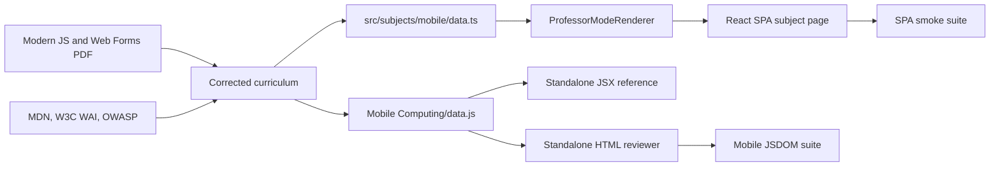

# Module / File: Networking 2/data.js

## Function: module initialization
- **Purpose**: Publish the complete Networking 2 learning-content contract for both UI implementations.
- **Inputs**: None.
- **Outputs**: `globalThis.reviewerData` containing `topics`, `glossary`, `flashcards`, `practiceTests`, `pathSteps`, and `studySteps`.
- **Dependencies**: JavaScript global scope.
- **Behavior**: Declares 15 topics, 293 glossary entries, 300 flashcards, 15 practice tests with 450 questions, five packet-path steps, and four study steps, then exposes them as one object.
- **Side Effects**: Assigns `globalThis.reviewerData`.

## Feature / Capability: Networking content model
- **Purpose**: Provide one data source for the offline HTML reviewer and React reference component.
- **Data Shapes**:
  - `topics[]`: `{ id, unit, title, color, subtitle, beginner, terms[], keyPoints[], compare, flow[] }`.
  - `glossary[]`: `[term, definition]`.
  - `flashcards[]`: `{ topic, front, back }`.
  - `practiceTests[]`: `{ title, description, questions[] }`.
  - `questions[]`: `{ q, options[], answer, explain }`.
- **Operational Mechanics**: The classic script runs before either consumer reads `globalThis.reviewerData`.

# Module / File: Networking 2/index.html

## Function: readStoredJson
- **Purpose**: Parse saved JSON without allowing malformed progress to stop startup.
- **Inputs**:
  - `key` (`string`): Local-storage key.
  - `fallback` (`unknown`): Safe default value.
- **Outputs**: Parsed JSON or `fallback`.
- **Dependencies**: `localStorage`, `JSON`.
- **Behavior**: Reads the key, substitutes serialized fallback when absent, and catches parsing or storage errors.
- **Side Effects**: Reads browser storage.

## Function: $
- **Purpose**: Select the first DOM element matching a CSS selector.
- **Inputs**:
  - `selector` (`string`): CSS selector.
  - `root` (`ParentNode`): Search root; defaults to `document`.
- **Outputs**: `Element|null`.
- **Dependencies**: DOM `querySelector`.
- **Behavior**: Delegates one selector lookup to the supplied root.
- **Side Effects**: None.

## Function: $$
- **Purpose**: Select all matching DOM elements as an array.
- **Inputs**:
  - `selector` (`string`): CSS selector.
  - `root` (`ParentNode`): Search root; defaults to `document`.
- **Outputs**: `Element[]`.
- **Dependencies**: DOM `querySelectorAll`.
- **Behavior**: Converts the returned `NodeList` to an array.
- **Side Effects**: None.

## Function: escapeHtml
- **Purpose**: Encode data-driven text before it enters `innerHTML`.
- **Inputs**:
  - `value` (`unknown`): Value to encode.
- **Outputs**: Escaped `string`.
- **Dependencies**: String replacement APIs.
- **Behavior**: Encodes ampersand, angle brackets, double quotes, and single quotes.
- **Side Effects**: None.

## Function: saveProgress
- **Purpose**: Persist Networking 2 learning progress.
- **Inputs**: None.
- **Outputs**: `void`.
- **Dependencies**: `state`, `localStorage`.
- **Behavior**: Serializes studied topic IDs, best quiz score, and viewed-card count.
- **Side Effects**: Writes `networking2Studied`, `networking2BestScore`, and `networking2SeenCards`.

## Function: showToast
- **Purpose**: Display temporary status feedback.
- **Inputs**:
  - `title` (`string`): Toast heading.
  - `detail` (`string`): Supporting message.
- **Outputs**: `void`.
- **Dependencies**: `escapeHtml`, DOM, timers.
- **Behavior**: Replaces toast markup, shows it, and schedules dismissal.
- **Side Effects**: Updates DOM and timer state.

## Function: applyTheme
- **Purpose**: Apply and persist the selected Networking 2 theme.
- **Inputs**: None.
- **Outputs**: `void`.
- **Dependencies**: `state.theme`, DOM, `localStorage`.
- **Behavior**: Updates the body theme, toggle icon, and accessible label.
- **Side Effects**: Writes `networking2Theme` and changes DOM attributes.

## Function: updateScrollProgress
- **Purpose**: Project document scroll position onto the progress indicator.
- **Inputs**: None.
- **Outputs**: `void`.
- **Dependencies**: `window`, document dimensions, DOM.
- **Behavior**: Calculates a guarded 0–100 percentage and updates the bar width.
- **Side Effects**: Changes inline style.

## Function: attachRevealEffects
- **Purpose**: Observe newly rendered reveal elements.
- **Inputs**:
  - `root` (`ParentNode`): Render subtree; defaults to `document`.
- **Outputs**: `void`.
- **Dependencies**: `IntersectionObserver`, `dataset`, reduced-motion preference.
- **Behavior**: Marks elements once, reveals visible items, and unobserves completed targets.
- **Side Effects**: Creates an observer and changes DOM classes/data attributes.

## Function: initRevealEffects
- **Purpose**: Initialize reveal animation handling for initial markup.
- **Inputs**: None.
- **Outputs**: `void`.
- **Dependencies**: `attachRevealEffects`.
- **Behavior**: Applies reveal behavior to the document.
- **Side Effects**: Registers observation.

## Function: iconSvg
- **Purpose**: Return inline SVG markup for a named interface icon.
- **Inputs**:
  - `name` (`string`): Icon identifier.
- **Outputs**: SVG `string`.
- **Dependencies**: Internal icon path map.
- **Behavior**: Selects a known icon definition and falls back safely.
- **Side Effects**: None.

## Function: topicIcon
- **Purpose**: Resolve the icon associated with a topic.
- **Inputs**:
  - `topic` (`object`): Topic record.
- **Outputs**: SVG `string`.
- **Dependencies**: Topic-to-icon map, `iconSvg`.
- **Behavior**: Maps the topic ID to a semantic icon name.
- **Side Effects**: None.

## Function: renderTopicCards
- **Purpose**: Render topic summaries and study controls.
- **Inputs**: None.
- **Outputs**: `void`.
- **Dependencies**: `topics`, `state`, `escapeHtml`, `topicIcon`, DOM.
- **Behavior**: Filters topics, replaces card markup, binds open/mark actions, and attaches reveals.
- **Side Effects**: Replaces DOM and registers listeners.

## Function: renderTopicDetail
- **Purpose**: Render the selected topic’s explanation, comparison, flow, and terms.
- **Inputs**: None.
- **Outputs**: `void`.
- **Dependencies**: `state.activeTopic`, `topics`, `escapeHtml`, DOM.
- **Behavior**: Projects the active topic and detail tab into the detail panel.
- **Side Effects**: Replaces DOM and binds tab/study controls.

## Function: renderProgress
- **Purpose**: Update Networking 2 completion statistics.
- **Inputs**: None.
- **Outputs**: `void`.
- **Dependencies**: `state`, `topics`, DOM.
- **Behavior**: Calculates topic completion and writes studied, score, card, and bar values.
- **Side Effects**: Updates DOM text and styles.

## Function: renderStudyAccordion
- **Purpose**: Render the four-pass study guide.
- **Inputs**: None.
- **Outputs**: `void`.
- **Dependencies**: `studySteps`, `escapeHtml`, DOM.
- **Behavior**: Builds accordion items and binds exclusive open/close behavior.
- **Side Effects**: Replaces DOM and registers listeners.

## Function: renderPathStep
- **Purpose**: Display the active packet-path step.
- **Inputs**: None.
- **Outputs**: `void`.
- **Dependencies**: `pathSteps`, `state.pathStep`, SVG nodes, DOM.
- **Behavior**: Updates labels and highlights matching nodes, wires, and controls.
- **Side Effects**: Changes DOM text and classes.

## Function: initPathControls
- **Purpose**: Build and animate the packet-path walkthrough.
- **Inputs**: None.
- **Outputs**: `void`.
- **Dependencies**: `pathSteps`, `renderPathStep`, timers.
- **Behavior**: Creates step buttons, binds manual selection/play-pause, and starts a 4.2-second loop.
- **Side Effects**: Registers listeners and a repeating timer.

## Function: filteredCards
- **Purpose**: Return cards matching the selected Networking topic.
- **Inputs**: None.
- **Outputs**: `object[]`.
- **Dependencies**: `flashcards`, `state.cardFilter`.
- **Behavior**: Returns all cards or filters by topic.
- **Side Effects**: None.

## Function: renderCardTopicOptions
- **Purpose**: Populate the Networking flashcard filter.
- **Inputs**: None.
- **Outputs**: `void`.
- **Dependencies**: `flashcards`, `escapeHtml`, DOM.
- **Behavior**: Builds one option per distinct topic plus All.
- **Side Effects**: Replaces select options.

## Function: renderFlashcard
- **Purpose**: Render the normalized current card and selected face.
- **Inputs**: None.
- **Outputs**: `void`.
- **Dependencies**: `filteredCards`, `state`, `escapeHtml`, `renderProgress`.
- **Behavior**: Wraps the index, renders front/back, and updates the counter.
- **Side Effects**: Updates DOM and normalizes `state.cardIndex`.

## Function: changeCard
- **Purpose**: Move through the Networking flashcard deck.
- **Inputs**:
  - `step` (`number`): Signed card movement.
- **Outputs**: `void`.
- **Dependencies**: `state`, `saveProgress`, `renderFlashcard`.
- **Behavior**: Moves the index, resets the face, increments views, saves, and renders.
- **Side Effects**: Mutates state and browser storage.

## Function: initFlashcards
- **Purpose**: Wire all Networking flashcard controls and keyboard shortcuts.
- **Inputs**: None.
- **Outputs**: `void`.
- **Dependencies**: Flashcard render/change helpers, DOM.
- **Behavior**: Binds filtering, flipping, navigation, shuffling, and keyboard actions.
- **Side Effects**: Registers event listeners.

## Function: renderTestOptions
- **Purpose**: Populate the Networking practice-test selector.
- **Inputs**: None.
- **Outputs**: `void`.
- **Dependencies**: `practiceTests`, `escapeHtml`, DOM.
- **Behavior**: Builds test options and resets answers when the selection changes.
- **Side Effects**: Updates DOM and state.

## Function: renderQuiz
- **Purpose**: Render Networking questions, choices, correctness, and explanations.
- **Inputs**: None.
- **Outputs**: `void`.
- **Dependencies**: `practiceTests`, `state.answers`, `escapeHtml`, DOM.
- **Behavior**: Creates choice controls and reveals correct/incorrect states after submission.
- **Side Effects**: Replaces DOM and registers choice listeners.

## Function: submitQuiz
- **Purpose**: Score the active Networking test.
- **Inputs**: None.
- **Outputs**: `void`.
- **Dependencies**: `practiceTests`, `state`, persistence and render helpers.
- **Behavior**: Counts correct answers, computes a percentage, preserves the best score, saves, and reveals feedback.
- **Side Effects**: Mutates state, browser storage, and DOM.

## Function: initQuiz
- **Purpose**: Initialize Networking test selection, submission, and reset.
- **Inputs**: None.
- **Outputs**: `void`.
- **Dependencies**: Quiz helpers, DOM.
- **Behavior**: Renders initial controls and binds submit/reset buttons.
- **Side Effects**: Registers listeners.

## Function: initPracticeTabs
- **Purpose**: Switch between Networking flashcards and tests.
- **Inputs**: None.
- **Outputs**: `void`.
- **Dependencies**: `[data-practice-tab]`, `.hidden`.
- **Behavior**: Keeps tab selection and panel visibility mutually exclusive.
- **Side Effects**: Changes classes and ARIA states.

## Function: renderGlossary
- **Purpose**: Render Networking terms matching letter and text filters.
- **Inputs**: None.
- **Outputs**: `void`.
- **Dependencies**: `glossary`, search input, `state.glossaryLetter`, `escapeHtml`.
- **Behavior**: Applies case-insensitive filters, renders cards or an empty state, and attaches reveals.
- **Side Effects**: Replaces DOM.

## Function: renderLetterChips
- **Purpose**: Build available first-letter glossary filters.
- **Inputs**: None.
- **Outputs**: `void`.
- **Dependencies**: `glossary`, `state.glossaryLetter`, `renderGlossary`.
- **Behavior**: Renders All plus present letters and binds selection.
- **Side Effects**: Replaces DOM and registers listeners.

## Function: renderGlobalSearch
- **Purpose**: Search Networking topics and glossary entries together.
- **Inputs**: None.
- **Outputs**: `void`.
- **Dependencies**: Search input, `topics`, `glossary`, render helpers.
- **Behavior**: Builds a capped result list and routes topic or term selections.
- **Side Effects**: Updates dropdown, state, fields, and scroll position.

## Function: initGlobalSearch
- **Purpose**: Wire Networking quick-find input and outside-click dismissal.
- **Inputs**: None.
- **Outputs**: `void`.
- **Dependencies**: `renderGlobalSearch`, DOM.
- **Behavior**: Binds input/focus rendering and document-level dismissal.
- **Side Effects**: Registers listeners.

## Function: initNavigation
- **Purpose**: Initialize mobile navigation and scroll-spy.
- **Inputs**: None.
- **Outputs**: `void`.
- **Dependencies**: Menu controls, `IntersectionObserver`.
- **Behavior**: Toggles mobile menu state and highlights the section near the viewport center.
- **Side Effects**: Registers listeners/observer and changes classes/ARIA.

## Function: initThemeAndProgress
- **Purpose**: Initialize theme switching and scroll progress.
- **Inputs**: None.
- **Outputs**: `void`.
- **Dependencies**: `applyTheme`, `updateScrollProgress`, window events.
- **Behavior**: Applies restored theme and binds theme, scroll, and resize handlers.
- **Side Effects**: Registers listeners and writes theme on changes.

## Function: initBackToTop
- **Purpose**: Control the Networking back-to-top button.
- **Inputs**: None.
- **Outputs**: `void`.
- **Dependencies**: Window position and scrolling API.
- **Behavior**: Shows the control after a threshold and scrolls to the top on activation.
- **Side Effects**: Registers listeners and changes scroll position.

## Function: populateHeroStats
- **Purpose**: Fill Networking headline content counts.
- **Inputs**: None.
- **Outputs**: `void`.
- **Dependencies**: Data-array lengths, DOM.
- **Behavior**: Counts topics, glossary entries, and all practice questions.
- **Side Effects**: Updates DOM text.

## Function: initPressEffects
- **Purpose**: Add pointer ripple feedback to interactive controls.
- **Inputs**: None.
- **Outputs**: `void`.
- **Dependencies**: Pointer events, DOM geometry.
- **Behavior**: Creates a positioned ripple span and removes it after animation.
- **Side Effects**: Registers a document listener and temporarily mutates DOM.

## Function: scrollToInitialHash
- **Purpose**: Honor a deep-link hash after initial rendering.
- **Inputs**: None.
- **Outputs**: `void`.
- **Dependencies**: `window.location.hash`, scrolling API, timers.
- **Behavior**: Reveals and scrolls to the target after layout settles.
- **Side Effects**: Changes scroll position.

## Function: boot
- **Purpose**: Initialize the complete Networking offline reviewer.
- **Inputs**: None.
- **Outputs**: `void`.
- **Dependencies**: Every Networking initialization and render helper.
- **Behavior**: Runs theme, reveal, navigation, topics, visualization, practice, glossary, and hash initialization in dependency-safe order.
- **Side Effects**: Fully renders the application and registers all runtime behavior.

## Feature / Capability: Networking offline reviewer
- **Purpose**: Offer zero-build topic review, packet-path visualization, flashcards, scored tests, glossary search, theme selection, and progress persistence.
- **Data Flow**: `data.js` → `globalThis.reviewerData` → inline `state` → render helpers → DOM; progress actions → Networking-specific local-storage keys.
- **Integration Points**: `data.js`, browser DOM APIs, `localStorage`, `IntersectionObserver`, Google Fonts with system-font fallback.

# Module / File: Networking 2/NetworkingTwoBeginnerGuide.jsx

## Function: Badge
- **Purpose**: Render compact Networking label content.
- **Inputs**:
  - `children` (`ReactNode`): Label content.
- **Outputs**: React element.
- **Dependencies**: React, Tailwind CSS.
- **Behavior**: Wraps content in badge styling.
- **Side Effects**: None.

## Function: Card
- **Purpose**: Render a reusable Networking surface.
- **Inputs**:
  - `children` (`ReactNode`): Card content.
  - `className` (`string`): Optional classes.
- **Outputs**: React element.
- **Dependencies**: React, Tailwind CSS.
- **Behavior**: Combines base and caller-supplied classes.
- **Side Effects**: None.

## Function: SectionHeader
- **Purpose**: Render a numbered Networking topic heading.
- **Inputs**:
  - `topic` (`object`): Topic data.
  - `index` (`number`): Display order.
- **Outputs**: React element.
- **Dependencies**: `iconMap`, `toneMap`.
- **Behavior**: Displays topic identity, icon, unit, title, and summary.
- **Side Effects**: None.

## Function: CompareTable
- **Purpose**: Render topic comparison data as a table.
- **Inputs**:
  - `compare` (`object`): Headers and rows.
- **Outputs**: React element.
- **Dependencies**: React.
- **Behavior**: Maps headers and cells into accessible table markup.
- **Side Effects**: None.

## Function: Flow
- **Purpose**: Render ordered Networking process steps.
- **Inputs**:
  - `steps` (`Array<[string,string]>`): Labels and explanations.
- **Outputs**: React element.
- **Dependencies**: React.
- **Behavior**: Maps each pair into a visual flow item.
- **Side Effects**: None.

## Function: TopicSection
- **Purpose**: Compose one complete Networking topic section.
- **Inputs**:
  - `topic` (`object`): Topic content.
  - `index` (`number`): Display order.
- **Outputs**: React element.
- **Dependencies**: `SectionHeader`, `CompareTable`, `Flow`.
- **Behavior**: Displays beginner text, terms, takeaways, comparisons, and flow.
- **Side Effects**: None.

## Function: FlashcardDeck
- **Purpose**: Provide stateful Networking flashcard practice.
- **Inputs**: None.
- **Outputs**: React element.
- **Dependencies**: React hooks, `flashcards`.
- **Behavior**: Filters topics, normalizes index, flips cards, and provides navigation.
- **Side Effects**: Updates React component state.

## Function: setTopic
- **Purpose**: Change the React flashcard topic.
- **Inputs**:
  - `topic` (`string`): Selected topic.
- **Outputs**: `void`.
- **Dependencies**: FlashcardDeck setters.
- **Behavior**: Sets the filter and resets index/face.
- **Side Effects**: Updates React state.

## Function: move
- **Purpose**: Move the React Networking card index.
- **Inputs**:
  - `step` (`number`): Signed movement.
- **Outputs**: `void`.
- **Dependencies**: FlashcardDeck state.
- **Behavior**: Advances the index and resets the face.
- **Side Effects**: Updates React state.

## Function: PracticeTest
- **Purpose**: Render and score one Networking React test.
- **Inputs**:
  - `test` (`object`): Practice-test record.
- **Outputs**: React element.
- **Dependencies**: React hooks.
- **Behavior**: Records answers, reveals correctness, and calculates the score.
- **Side Effects**: Updates React state.

## Function: reset
- **Purpose**: Clear a React Networking practice attempt.
- **Inputs**: None.
- **Outputs**: `void`.
- **Dependencies**: PracticeTest setters.
- **Behavior**: Clears answers and submission state.
- **Side Effects**: Updates React state.

## Function: PracticeZone
- **Purpose**: Select and render Networking practice tests.
- **Inputs**: None.
- **Outputs**: React element.
- **Dependencies**: `practiceTests`, `PracticeTest`.
- **Behavior**: Maintains test selection and delegates test rendering.
- **Side Effects**: Updates React state.

## Function: GlossaryPanel
- **Purpose**: Provide live Networking glossary search.
- **Inputs**: None.
- **Outputs**: React element.
- **Dependencies**: React hooks, `glossary`.
- **Behavior**: Memoizes case-insensitive term/definition filtering and renders results.
- **Side Effects**: Updates query state.

## Function: NetworkingTwoBeginnerGuide
- **Purpose**: Export the complete Networking React reference reviewer.
- **Inputs**: None.
- **Outputs**: React application tree.
- **Dependencies**: React, Tailwind CSS, `lucide-react`, shared data components.
- **Behavior**: Composes navigation, hero, all topics, practice, and glossary.
- **Side Effects**: Updates mobile-navigation state.

# Module / File: Systems Integration and Architecture 1/data.js

## Function: moduleForGlossaryIndex
- **Purpose**: Resolve which course module owns a glossary position.
- **Inputs**:
  - `index` (`number`): Zero-based glossary position.
- **Outputs**: The owning `module` record from `modules[]`.
- **Dependencies**: `modules`, `TERMS_PER_MODULE`.
- **Behavior**: Divides the index by `TERMS_PER_MODULE`, clamping to the last module so an off-by-one cannot return `undefined`.
- **Side Effects**: None.

## Function: buildQuestionSet
- **Purpose**: Generate one deterministic module test from glossary definitions.
- **Inputs**:
  - `entries` (`Array<{term,definition,moduleId,moduleLabel,moduleTitle}>`): One module’s enriched glossary entries.
  - `moduleIndex` (`number`): Module position used to rotate correct answers.
- **Outputs**: `Question[]` with `q`, four `options`, valid `answer`, and `explain`.
- **Dependencies**: Array mapping and the enriched glossary entry shape.
- **Behavior**: Uses three same-module definition offsets (`+3`, `+7`, `+11`, modulo the segment length) as plausible distractors and rotates the correct option across positions. Because every glossary definition is unique, no generated question can contain a repeated option.
- **Side Effects**: None.

## Function: module initialization
- **Purpose**: Publish the complete SIA 1 Modules 1–5 learning-content contract.
- **Inputs**: None.
- **Outputs**: `globalThis.reviewerData`.
- **Dependencies**: `moduleForGlossaryIndex`, `buildQuestionSet`, an immediately invoked private function scope, and `globalThis`.
- **Behavior**: Creates course metadata, ten modules, 28 topics, 200 glossary entries, 200 enriched glossary entries, 200 derived flashcards, ten generated 20-question tests, four blueprint stages, three model layers, 39 scenarios, four study steps, and seven standards references inside a private scope so their `const` names cannot collide with the inline classic script.
- **Side Effects**: Assigns `globalThis.reviewerData`.

## Feature / Capability: SIA content model
- **Purpose**: Keep HTML and React learning content synchronized.
- **Data Shapes**:
  - `course`: `{ id, title, shortTitle, moduleLabel, description }`.
  - `termsPerModule`: `number` — the single source of truth for glossary grouping (currently `20`).
  - `modules[]`: `{ id, label, title, objective }`.
  - `topics[]`: Existing shared topic shape plus `moduleId` and `example`.
  - `glossary[]`: `[term, definition]` tuples, ordered by module.
  - `glossaryEntries[]`: `{ term, definition, moduleId, moduleLabel, moduleTitle }` — the enriched view every consumer reads.
  - `flashcards[]`: `{ topic, front, back }`, derived one-per-glossary-entry.
  - `practiceTests[]`: `{ title, description, questions[] }`, one test per module.
  - `blueprintStages[]`: `{ id, title, question, summary, includes[], example }`.
  - `modelLayers[]`: `{ id, label, question, description, constructs[], example }`.
  - `scenarios[]`: `{ id, moduleId, category, prompt, options[], answer, explanation }`.
  - `references[]`: `{ id, moduleId, title, publisher, note, url }` — published standards behind Modules 2, 3, and 5.
- **Operational Mechanics**: Glossary entries are stored in module order, `termsPerModule` at a time. `glossaryEntries` is the only place that grouping rule is applied; `flashcards`, `practiceTests`, `index.html`, and the JSX component all read the enriched view instead of recomputing `Math.floor(index / 20)`.
- **Module Coverage**: `m1-1` EIA, `m1-2` IT Governance, `m1-3` Information and Data Modelling, `m2-1` SOA, `m2-2` Microservices, `m3-1` XML and JSON, `m3-2` Web Services and SOAP, `m5-1` EAI, `m5-2` Middleware, `m5-3` Cloud Computing. There is no Module 4 in the supplied course materials, and none is invented here.

# Module / File: Systems Integration and Architecture 1/index.html

## Function: $
- **Purpose**: Select the first element matching a CSS selector.
- **Inputs**:
  - `selector` (`string`): CSS selector.
  - `root` (`ParentNode`): Search root.
- **Outputs**: `Element|null`.
- **Dependencies**: DOM.
- **Behavior**: Delegates to `querySelector`.
- **Side Effects**: None.

## Function: $$
- **Purpose**: Return all matching elements as an array.
- **Inputs**:
  - `selector` (`string`): CSS selector.
  - `root` (`ParentNode`): Search root.
- **Outputs**: `Element[]`.
- **Dependencies**: DOM.
- **Behavior**: Converts `querySelectorAll` output to an array.
- **Side Effects**: None.

## Function: escapeHtml
- **Purpose**: Encode all data-driven text used in HTML templates.
- **Inputs**:
  - `value` (`unknown`): Value to encode.
- **Outputs**: Escaped `string`.
- **Dependencies**: String APIs.
- **Behavior**: Encodes HTML-sensitive characters.
- **Side Effects**: None.

## Function: safeExternalUrl
- **Purpose**: Ensure only absolute `https` links reach an `href` attribute.
- **Inputs**:
  - `value` (`unknown`): Candidate reference URL.
- **Outputs**: The normalized `string` URL, or `null` when the value is not an https link.
- **Dependencies**: `URL`.
- **Behavior**: Parses the value with the `URL` constructor and returns it only when `protocol === "https:"`, so a malformed or `javascript:` entry in `references[]` cannot become an executable link.
- **Side Effects**: None.

## Function: storageGet
- **Purpose**: Read SIA progress without allowing storage restrictions to break the app.
- **Inputs**:
  - `key` (`string`): Storage key.
- **Outputs**: `string|null`.
- **Dependencies**: `localStorage`.
- **Behavior**: Returns the stored string or null after any error.
- **Side Effects**: Reads browser storage.

## Function: storageSet
- **Purpose**: Write SIA progress with graceful failure feedback.
- **Inputs**:
  - `key` (`string`): Storage key.
  - `value` (`string`): Serialized value.
- **Outputs**: `void`.
- **Dependencies**: `localStorage`, `showToast`.
- **Behavior**: Writes the value and reports session-only progress if storage is blocked.
- **Side Effects**: Writes browser storage or shows a toast.

## Function: readStoredJson
- **Purpose**: Parse persisted SIA JSON defensively.
- **Inputs**:
  - `key` (`string`): Storage key.
  - `fallback` (`unknown`): Safe default.
- **Outputs**: Parsed value or fallback.
- **Dependencies**: `storageGet`, `JSON`.
- **Behavior**: Parses present data and catches malformed values.
- **Side Effects**: Reads browser storage.

## Function: safeCount
- **Purpose**: Normalize saved counts.
- **Inputs**:
  - `value` (`unknown`): Candidate number.
- **Outputs**: Non-negative integer.
- **Dependencies**: Number APIs.
- **Behavior**: Floors finite non-negative values and otherwise returns zero.
- **Side Effects**: None.

## Function: saveProgress
- **Purpose**: Persist all SIA learning progress.
- **Inputs**: None.
- **Outputs**: `void`.
- **Dependencies**: `state`, `storageSet`.
- **Behavior**: Serializes studied topics, best score, card views, and completed/correct scenario IDs.
- **Side Effects**: Writes `sia1Studied`, `sia1BestScore`, `sia1SeenCards`, and `sia1ScenarioProgress`.

## Function: showToast
- **Purpose**: Announce temporary SIA status feedback.
- **Inputs**:
  - `title` (`string`): Heading.
  - `detail` (`string`): Explanation.
- **Outputs**: `void`.
- **Dependencies**: `escapeHtml`, DOM, timer.
- **Behavior**: Renders safe text, shows the toast, and resets its dismissal timer.
- **Side Effects**: Updates DOM and timer state.

## Function: applyTheme
- **Purpose**: Apply and persist the SIA theme.
- **Inputs**: None.
- **Outputs**: `void`.
- **Dependencies**: `state.theme`, `storageSet`, DOM.
- **Behavior**: Sets body theme, toggle glyph, and accessible label.
- **Side Effects**: Writes `sia1Theme` and changes DOM.

## Function: updateScrollProgress
- **Purpose**: Update reading progress and back-to-top visibility.
- **Inputs**: None.
- **Outputs**: `void`.
- **Dependencies**: Window/document dimensions.
- **Behavior**: Calculates a guarded percentage and compares scroll position with a viewport threshold.
- **Side Effects**: Changes inline style and classes.

## Function: attachRevealEffects
- **Purpose**: Reveal newly rendered SIA elements once they enter the viewport.
- **Inputs**:
  - `root` (`ParentNode`): Subtree to inspect.
- **Outputs**: `void`.
- **Dependencies**: `IntersectionObserver`, reduced-motion media query.
- **Behavior**: Reveals immediately for reduced motion or observes unprepared elements once.
- **Side Effects**: Creates an observer and changes DOM classes/data attributes.

## Function: populateHeroStats
- **Purpose**: Fill SIA hero totals from source data.
- **Inputs**: None.
- **Outputs**: `void`.
- **Dependencies**: Data arrays, DOM.
- **Behavior**: Writes topic, card, question, and scenario totals.
- **Side Effects**: Updates DOM.

## Function: renderProgress
- **Purpose**: Render persistent SIA progress indicators.
- **Inputs**: None.
- **Outputs**: `void`.
- **Dependencies**: `state`, `topics`, DOM.
- **Behavior**: Computes topic percentage and shows best quiz, scenario accuracy, and card views.
- **Side Effects**: Updates DOM text and styles.

## Function: renderModuleFilters
- **Purpose**: Render all-topic and three-module topic filters.
- **Inputs**: None.
- **Outputs**: `void`.
- **Dependencies**: `modules`, `state.moduleFilter`, `renderTopicCards`.
- **Behavior**: Builds controls, marks the active one, and binds selection.
- **Side Effects**: Replaces DOM, changes state, and registers listeners.

## Function: filteredTopics
- **Purpose**: Return topics matching the selected SIA module.
- **Inputs**: None.
- **Outputs**: `object[]`.
- **Dependencies**: `topics`, `state.moduleFilter`.
- **Behavior**: Returns all topics or filters by `moduleId`.
- **Side Effects**: None.

## Function: renderTopicCards
- **Purpose**: Render SIA topic summaries and study actions.
- **Inputs**: None.
- **Outputs**: `void`.
- **Dependencies**: `filteredTopics`, `modules`, `state`, `escapeHtml`.
- **Behavior**: Creates cards, labels study status, binds guide/study controls, and reveals them.
- **Side Effects**: Replaces DOM and registers listeners.

## Function: toggleStudied
- **Purpose**: Toggle and persist one SIA topic’s completion.
- **Inputs**:
  - `topicId` (`string`): Valid topic identifier.
- **Outputs**: `void`.
- **Dependencies**: `validTopicIds`, `state`, persistence/render helpers.
- **Behavior**: Rejects unknown IDs, toggles set membership, saves, refreshes progress/cards/dialog, and announces status.
- **Side Effects**: Mutates state, storage, and DOM.

## Function: openTopic
- **Purpose**: Render one complete SIA topic in an accessible dialog.
- **Inputs**:
  - `topicId` (`string`): Topic identifier.
  - `show` (`boolean`): Whether to open a closed dialog.
- **Outputs**: `void`.
- **Dependencies**: `topics`, `modules`, `escapeHtml`, native dialog API.
- **Behavior**: Builds beginner text, example, takeaways, terms, comparison, flow, and study control.
- **Side Effects**: Replaces dialog DOM, registers a listener, and may open the dialog.

## Function: renderStudySteps
- **Purpose**: Render the SIA four-pass study loop.
- **Inputs**: None.
- **Outputs**: `void`.
- **Dependencies**: `studySteps`, `escapeHtml`.
- **Behavior**: Maps steps to four structured cards.
- **Side Effects**: Replaces DOM.

## Function: renderReferences
- **Purpose**: Render the published standards that back Modules 2, 3, and 5.
- **Inputs**: None.
- **Outputs**: `void`.
- **Dependencies**: `references`, `modules`, `safeExternalUrl`, `escapeHtml`, `attachRevealEffects`.
- **Behavior**: Maps each reference to a card tagged with its module label. A usable https URL becomes an anchor with `target="_blank"` and `rel="noopener noreferrer"`; anything else degrades to plain escaped text rather than disappearing. Returns early when `#referenceList` is absent.
- **Side Effects**: Replaces the contents of `#referenceList` and registers reveal observers.

## Function: renderBlueprint
- **Purpose**: Render the four-stage EIA reference-architecture explorer.
- **Inputs**: None.
- **Outputs**: `void`.
- **Dependencies**: `blueprintStages`, `state.blueprintIndex`, `escapeHtml`.
- **Behavior**: Renders path, tabs, selected-stage detail, and guarded previous/next controls.
- **Side Effects**: Replaces DOM, mutates stage index, and registers listeners.

## Function: renderModelLens
- **Purpose**: Render conceptual, logical, and physical model-layer detail.
- **Inputs**: None.
- **Outputs**: `void`.
- **Dependencies**: `modelLayers`, `state.modelLayerIndex`, `renderModelMatch`.
- **Behavior**: Builds layer tabs, selected constructs/example, and the companion matching activity.
- **Side Effects**: Replaces DOM, mutates selection, and registers listeners.

## Function: renderModelMatch
- **Purpose**: Render one model-construct classification prompt.
- **Inputs**: None.
- **Outputs**: `void`.
- **Dependencies**: `modelMatchItems`, `modelLayers`, matching state.
- **Behavior**: Shows three layer choices, immediate correctness, and cyclic next/restart control.
- **Side Effects**: Replaces DOM, mutates match state, and registers listeners.

## Function: filteredScenarios
- **Purpose**: Return scenarios for the active category.
- **Inputs**: None.
- **Outputs**: `object[]`.
- **Dependencies**: `scenarios`, `state.scenarioFilter`.
- **Behavior**: Returns all scenarios or filters by category.
- **Side Effects**: None.

## Function: renderScenarioFilters
- **Purpose**: Render All, Data Realms, Governance, and Model Layers filters.
- **Inputs**: None.
- **Outputs**: `void`.
- **Dependencies**: `scenarios`, scenario state, `renderScenario`.
- **Behavior**: Builds unique categories and resets the active scenario when changed.
- **Side Effects**: Replaces DOM, mutates state, and registers listeners.

## Function: renderScenario
- **Purpose**: Render one applied SIA decision challenge with feedback.
- **Inputs**: None.
- **Outputs**: `void`.
- **Dependencies**: `filteredScenarios`, `modules`, scenario state, persistence helpers.
- **Behavior**: Normalizes the index, renders choices, records completed/correct IDs, reveals explanation, and supports navigation.
- **Side Effects**: Replaces DOM, mutates state/storage, and registers listeners.

## Function: filteredCards
- **Purpose**: Return SIA cards matching the selected module title.
- **Inputs**: None.
- **Outputs**: `object[]`.
- **Dependencies**: `flashcards`, `state.cardTopic`.
- **Behavior**: Returns all cards or filters by `topic`.
- **Side Effects**: None.

## Function: renderCardTopicOptions
- **Purpose**: Populate the SIA card-topic selector.
- **Inputs**: None.
- **Outputs**: `void`.
- **Dependencies**: `flashcards`, `escapeHtml`.
- **Behavior**: Builds All plus one option for each distinct module title.
- **Side Effects**: Replaces select options.

## Function: renderFlashcard
- **Purpose**: Render the normalized current SIA card face.
- **Inputs**: None.
- **Outputs**: `void`.
- **Dependencies**: `filteredCards`, card state, `escapeHtml`.
- **Behavior**: Handles empty decks, wraps indexes, and renders question/answer plus counter.
- **Side Effects**: Updates DOM and normalizes `state.cardIndex`.

## Function: changeCard
- **Purpose**: Navigate SIA flashcards and count views.
- **Inputs**:
  - `step` (`number`): Signed movement.
- **Outputs**: `void`.
- **Dependencies**: Card state, persistence/render helpers.
- **Behavior**: Moves the index, resets the face, increments views, saves, and renders.
- **Side Effects**: Mutates state/storage/DOM.

## Function: renderTestOptions
- **Purpose**: Populate the three SIA module-test options.
- **Inputs**: None.
- **Outputs**: `void`.
- **Dependencies**: `practiceTests`, `escapeHtml`.
- **Behavior**: Builds one option per module test and marks the selected index.
- **Side Effects**: Replaces select options.

## Function: renderQuiz
- **Purpose**: Render the active twenty-question SIA test.
- **Inputs**: None.
- **Outputs**: `void`.
- **Dependencies**: `practiceTests`, quiz state, `escapeHtml`.
- **Behavior**: Renders choices, selection states, correctness, explanations, and answer handlers.
- **Side Effects**: Replaces DOM and mutates answers through listeners.

## Function: submitQuiz
- **Purpose**: Score the selected SIA test.
- **Inputs**: None.
- **Outputs**: `void`.
- **Dependencies**: `practiceTests`, quiz state, persistence/render helpers.
- **Behavior**: Counts correct answers, computes percentage, preserves best score, saves, renders, and announces.
- **Side Effects**: Mutates state/storage/DOM.

## Function: renderGlossaryFilters
- **Purpose**: Render SIA glossary module filters.
- **Inputs**: None.
- **Outputs**: `void`.
- **Dependencies**: `modules`, glossary state, `renderGlossary`.
- **Behavior**: Builds an All control plus one control per course module and binds selection.
- **Side Effects**: Replaces DOM, mutates state, and registers listeners.

## Function: renderGlossary
- **Purpose**: Render SIA terms matching module and text filters.
- **Inputs**: None.
- **Outputs**: `void`.
- **Dependencies**: `glossaryEntries`, search input, `escapeHtml`.
- **Behavior**: Filters the pre-grouped `glossaryEntries` by module id and case-insensitive text, then renders cards or an empty state. The module-grouping rule lives in `data.js`, not here.
- **Side Effects**: Replaces DOM and attaches reveals.

## Function: renderGlobalSearch
- **Purpose**: Search SIA topics and glossary terms together.
- **Inputs**: None.
- **Outputs**: `void`.
- **Dependencies**: `topics`, `glossary`, search input, topic/glossary render helpers.
- **Behavior**: Caps matches, renders a result box, opens topics, or routes terms to filtered glossary results.
- **Side Effects**: Replaces DOM, changes fields/state, opens dialogs, and scrolls.

## Function: initControls
- **Purpose**: Bind stable SIA controls that are not replaced by render functions.
- **Inputs**: None.
- **Outputs**: `void`.
- **Dependencies**: Theme, menu, dialog, search, flashcard, quiz, tab, scroll, and keyboard helpers.
- **Behavior**: Registers all persistent UI event handlers, including accessible keyboard card navigation.
- **Side Effects**: Registers listeners and triggers state/DOM/storage changes during use.

## Function: initNavigationObserver
- **Purpose**: Highlight the SIA section near the viewport center.
- **Inputs**: None.
- **Outputs**: `void`.
- **Dependencies**: `IntersectionObserver`, section IDs, nav links.
- **Behavior**: Observes six sections and toggles active links for intersecting entries.
- **Side Effects**: Creates an observer and changes classes.

## Function: boot
- **Purpose**: Initialize the complete SIA offline reviewer.
- **Inputs**: None.
- **Outputs**: `void`.
- **Dependencies**: Every SIA render and initialization helper.
- **Behavior**: Applies theme, renders all learning areas, binds controls/navigation, attaches reveals, and updates scrolling state.
- **Side Effects**: Fully renders and activates the application.

## Feature / Capability: SIA offline reviewer
- **Purpose**: Provide a zero-build responsive reviewer for all three supplied Module 1 lessons.
- **Capabilities**: Fourteen topic guides, module filtering, progress, EIA blueprint, model-layer lens and matching, 18 scenarios, 54 cards, three 20-question tests, 60-term glossary, global search, dark mode, reduced-motion support, and keyboard access.
- **Data Flow**: `data.js` → `globalThis.reviewerData` → validated `state` → render functions → DOM; progress actions → isolated `sia1*` keys.
- **Responsive Mechanics**: Grid breakpoints at 980, 700, and 440 pixels; horizontal overflow is constrained; mobile brand/tools and typography are compressed; decorative artwork is clipped inside its column.

# Module / File: Systems Integration and Architecture 1/SystemsIntegrationArchitectureOneBeginnerGuide.jsx

## Function: Chip
- **Purpose**: Render a reusable compact label.
- **Inputs**:
  - `children` (`ReactNode`): Label content.
- **Outputs**: React element.
- **Dependencies**: React, Tailwind CSS.
- **Behavior**: Wraps content in shared chip styling.
- **Side Effects**: None.

## Function: Panel
- **Purpose**: Render a reusable bordered content surface.
- **Inputs**:
  - `children` (`ReactNode`): Panel content.
  - `className` (`string`): Optional classes.
- **Outputs**: React element.
- **Dependencies**: React, Tailwind CSS.
- **Behavior**: Combines base surface classes with caller classes.
- **Side Effects**: None.

## Function: readStoredJson
- **Purpose**: Restore JSON safely in browsers while tolerating SSR and blocked storage.
- **Inputs**:
  - `key` (`string`): Storage key.
  - `fallback` (`unknown`): Default.
- **Outputs**: Parsed value or fallback.
- **Dependencies**: `window`, `localStorage`, `JSON`.
- **Behavior**: Returns fallback without accessing storage during SSR and catches runtime errors.
- **Side Effects**: Reads browser storage.

## Function: TopicDetail
- **Purpose**: Render one expanded React SIA topic.
- **Inputs**:
  - `topic` (`object`): Topic record.
  - `studied` (`boolean`): Completion state.
  - `onToggle` (`Function`): Completion callback.
  - `onClose` (`Function`): Close callback.
- **Outputs**: React element.
- **Dependencies**: `modules`, `Chip`, `Panel`.
- **Behavior**: Displays example, key points, terms, table, flow, and actions.
- **Side Effects**: Calls supplied callbacks on user action.

## Function: TopicDashboard
- **Purpose**: Provide React module filtering, topic cards, detail, and completion.
- **Inputs**: None.
- **Outputs**: React element.
- **Dependencies**: React hooks, `topics`, `modules`, `TopicDetail`.
- **Behavior**: Validates restored IDs, memoizes filtering, persists studied IDs, and renders cards/details.
- **Side Effects**: Updates React state and `sia1Studied`.

## Function: toggleStudied
- **Purpose**: Toggle one React SIA topic ID.
- **Inputs**:
  - `topicId` (`string`): Topic identifier.
- **Outputs**: `void`.
- **Dependencies**: TopicDashboard state setter.
- **Behavior**: Copies the Set and toggles membership.
- **Side Effects**: Updates React state, which triggers persistence.

## Function: BlueprintExplorer
- **Purpose**: Render the React four-stage EIA blueprint.
- **Inputs**: None.
- **Outputs**: React element.
- **Dependencies**: React state, `blueprintStages`, `Panel`.
- **Behavior**: Maintains selected stage and displays its summary, inclusions, and example.
- **Side Effects**: Updates React state.

## Function: ModelLens
- **Purpose**: Render React model-layer detail and construct matching.
- **Inputs**: None.
- **Outputs**: React element.
- **Dependencies**: React state, `modelLayers`, `Panel`.
- **Behavior**: Switches layers, evaluates six representative matches, and cycles prompts.
- **Side Effects**: Updates React state.

## Function: ScenarioLab
- **Purpose**: Render all React SIA scenario challenges.
- **Inputs**: None.
- **Outputs**: React element.
- **Dependencies**: React hooks, `scenarios`, `Panel`.
- **Behavior**: Filters categories, records selection/completion, reveals explanations, cycles challenges, and persists completion IDs.
- **Side Effects**: Updates React state and `sia1ScenarioProgress`.

## Function: choose
- **Purpose**: Record one React scenario choice.
- **Inputs**:
  - `optionIndex` (`number`): Selected option.
- **Outputs**: `void`.
- **Dependencies**: ScenarioLab setters and active scenario.
- **Behavior**: Stores selection and adds the scenario ID to completed progress.
- **Side Effects**: Updates React state.

## Function: Flashcards
- **Purpose**: Render React SIA card filtering, flipping, and navigation.
- **Inputs**: None.
- **Outputs**: React element.
- **Dependencies**: React hooks, `flashcards`, `Chip`, `Panel`.
- **Behavior**: Memoizes filtered cards, wraps the index, and resets face on moves/filter changes.
- **Side Effects**: Updates React state.

## Function: move
- **Purpose**: Navigate the React SIA flashcard deck.
- **Inputs**:
  - `step` (`number`): Signed movement.
- **Outputs**: `void`.
- **Dependencies**: Flashcards state.
- **Behavior**: Moves from the normalized index and resets the face.
- **Side Effects**: Updates React state.

## Function: ModuleTest
- **Purpose**: Render and score one React SIA module test.
- **Inputs**: None.
- **Outputs**: React element.
- **Dependencies**: React state, `practiceTests`, `Panel`.
- **Behavior**: Selects tests, records answers, calculates score, reveals explanations, and resets attempts.
- **Side Effects**: Updates React state.

## Function: PracticeZone
- **Purpose**: Compose React flashcard and test practice.
- **Inputs**: None.
- **Outputs**: React element.
- **Dependencies**: `Flashcards`, `ModuleTest`.
- **Behavior**: Places both practice tools in a responsive grid.
- **Side Effects**: None beyond child behavior.

## Function: Glossary
- **Purpose**: Provide React SIA glossary module and text filtering.
- **Inputs**: None.
- **Outputs**: React element.
- **Dependencies**: React hooks, `glossary`, `modules`, `Panel`.
- **Behavior**: Maps glossary ranges to modules, memoizes filtering, and renders results.
- **Side Effects**: Updates query/filter state.

## Function: SystemsIntegrationArchitectureOneBeginnerGuide
- **Purpose**: Export the complete SIA React reference reviewer.
- **Inputs**: None.
- **Outputs**: React application tree.
- **Dependencies**: React, Tailwind CSS, shared SIA components and data.
- **Behavior**: Composes sticky navigation, hero, topics, blueprint, models, scenarios, practice, glossary, and study loop.
- **Side Effects**: Updates local dark-mode state; child components may persist progress.

# Module / File: html-diagnostics.js

## Function: pass
- **Purpose**: Print a passing diagnostic.
- **Inputs**:
  - `message` (`string`): Success text.
- **Outputs**: `true`.
- **Dependencies**: Console.
- **Behavior**: Prints a prefixed success line.
- **Side Effects**: Writes stdout.

## Function: fail
- **Purpose**: Print a failing diagnostic.
- **Inputs**:
  - `message` (`string`): Failure text.
- **Outputs**: `false`.
- **Dependencies**: Console.
- **Behavior**: Prints a prefixed failure line.
- **Side Effects**: Writes stderr.

## Function: readSource
- **Purpose**: Read one required UTF-8 source file.
- **Inputs**:
  - `filePath` (`string`): Absolute path.
- **Outputs**: File `string` or `null`.
- **Dependencies**: Node `fs`.
- **Behavior**: Reports missing files and otherwise reads text.
- **Side Effects**: Reads disk and may print a failure.

## Function: extractStyleBlock
- **Purpose**: Extract the first inline CSS block.
- **Inputs**:
  - `html` (`string`): HTML source.
- **Outputs**: CSS `string`.
- **Dependencies**: Regular expressions.
- **Behavior**: Returns captured style content or an empty string.
- **Side Effects**: None.

## Function: extractInlineScripts
- **Purpose**: Extract inline JavaScript while excluding `src` scripts.
- **Inputs**:
  - `html` (`string`): HTML source.
- **Outputs**: `string[]`.
- **Dependencies**: Regular expressions.
- **Behavior**: Iterates every inline script match.
- **Side Effects**: None.

## Function: extractIds
- **Purpose**: Extract literal HTML `id` values without matching data attributes.
- **Inputs**:
  - `html` (`string`): HTML source.
- **Outputs**: `string[]`.
- **Dependencies**: Regular expressions.
- **Behavior**: Matches whitespace-prefixed `id` attributes.
- **Side Effects**: None.

## Function: checkHtmlContract
- **Purpose**: Validate each reviewer’s structural HTML/CSS/script contract.
- **Inputs**:
  - `reviewer` (`object`): Diagnostic configuration.
  - `html` (`string`): Source.
- **Outputs**: `boolean[]`.
- **Dependencies**: Extraction helpers and reviewer expectations.
- **Behavior**: Checks doctype, `.hidden`, observer guard, script order, duplicate IDs, and required IDs.
- **Side Effects**: Prints results.

## Function: checkJavaScriptSyntax
- **Purpose**: Parse data and inline scripts without executing browser code.
- **Inputs**:
  - `dataSource` (`string`): Data script.
  - `inlineScripts` (`string[]`): Runtime blocks.
- **Outputs**: `boolean`.
- **Dependencies**: Node `vm`.
- **Behavior**: Compiles each script and reports the first syntax error.
- **Side Effects**: Prints result.

## Function: checkClassicGlobalCollisions
- **Purpose**: Detect top-level lexical names that would prevent separate classic scripts from sharing the browser global scope.
- **Inputs**:
  - `dataSource` (`string`): Shared data JavaScript.
  - `inlineScripts` (`string[]`): Inline reviewer runtime blocks.
- **Outputs**: `boolean`.
- **Dependencies**: Node `vm`, `pass`, `fail`.
- **Behavior**: Compiles the concatenated data and inline sources as one classic-script scope so duplicate `const` or `let` declarations fail before deployment.
- **Side Effects**: Prints the collision result.

## Function: evaluateReviewerData
- **Purpose**: Evaluate a data script in an isolated context.
- **Inputs**:
  - `source` (`string`): Data JavaScript.
- **Outputs**: `reviewerData` object or `null`.
- **Dependencies**: Node `vm`.
- **Behavior**: Provides isolated `globalThis`, enforces a timeout, and returns the published contract.
- **Side Effects**: Executes isolated data initialization and may print failure.

## Function: countQuestions
- **Purpose**: Count questions across all tests.
- **Inputs**:
  - `tests` (`object[]`): Test records.
- **Outputs**: `number`.
- **Dependencies**: Array APIs.
- **Behavior**: Safely sums valid `questions` arrays.
- **Side Effects**: None.

## Function: checkContentCounts
- **Purpose**: Enforce exact reviewer content totals.
- **Inputs**:
  - `reviewer` (`object`): Expected counts.
  - `data` (`object`): Evaluated data.
- **Outputs**: `boolean[]`.
- **Dependencies**: `countQuestions`, `pass`, `fail`.
- **Behavior**: Compares every configured array/question total.
- **Side Effects**: Prints results.

## Function: checkUniqueIds
- **Purpose**: Validate record IDs.
- **Inputs**:
  - `records` (`object[]`): ID-bearing records.
  - `label` (`string`): Collection name.
- **Outputs**: `boolean`.
- **Dependencies**: Set/array APIs.
- **Behavior**: Finds missing, blank, and duplicate identifiers.
- **Side Effects**: Prints result.

## Function: checkSharedDataShapes
- **Purpose**: Validate common topic, glossary, and flashcard contracts.
- **Inputs**:
  - `data` (`object`): Evaluated reviewer data.
- **Outputs**: `boolean[]`.
- **Dependencies**: Shared data schema.
- **Behavior**: Checks required topic fields, glossary tuples, and flashcard strings.
- **Side Effects**: Prints results.

## Function: checkAnswerIndexes
- **Purpose**: Validate quiz and scenario answer indexes and explanations.
- **Inputs**:
  - `data` (`object`): Evaluated reviewer data.
- **Outputs**: `boolean[]`.
- **Dependencies**: Test/scenario schemas.
- **Behavior**: Ensures option arrays, in-range integer answers, and explanation strings.
- **Side Effects**: Prints results.

## Function: checkSiaRelationships
- **Purpose**: Validate SIA module references and model-layer definitions.
- **Inputs**:
  - `data` (`object`): Evaluated reviewer data.
- **Outputs**: `boolean[]`.
- **Dependencies**: SIA schemas, `checkGlossaryGrouping`, `checkReferences`.
- **Behavior**: Verifies topic/scenario `moduleId` values and non-empty layer construct lists, then delegates to the glossary-grouping and reference checks.
- **Side Effects**: Prints results.

## Function: checkGlossaryGrouping
- **Purpose**: Prove the enriched glossary view has not drifted from the tuple glossary.
- **Inputs**:
  - `data` (`object`): Evaluated reviewer data.
- **Outputs**: `boolean[]`.
- **Dependencies**: `data.glossary`, `data.glossaryEntries`, `data.modules`, `data.termsPerModule`.
- **Behavior**: Compares the two glossary views entry for entry, asserts every module owns exactly `termsPerModule` terms, and reports duplicate terms or duplicate definitions. Duplicate definitions matter because `buildQuestionSet` draws distractors from the same module segment, so a repeat would make a generated question ambiguous.
- **Side Effects**: Prints results.

## Function: checkReferences
- **Purpose**: Validate the standards reference list.
- **Inputs**:
  - `data` (`object`): Evaluated reviewer data.
- **Outputs**: `boolean[]`.
- **Dependencies**: `checkUniqueIds`, `data.modules`, `data.references`.
- **Behavior**: Confirms unique identifiers, a resolvable `moduleId`, present title/publisher/note strings, and an `https://` URL on every reference.
- **Side Effects**: Prints results.

## Function: runReviewerDiagnostics
- **Purpose**: Execute all configured checks for one reviewer.
- **Inputs**:
  - `reviewer` (`object`): Configuration.
- **Outputs**: `boolean`.
- **Dependencies**: All diagnostic helpers, Node `path`.
- **Behavior**: Reads sources, checks structure and individual syntax, checks shared classic-script scope, evaluates data, validates counts/shapes/relationships, and aggregates results.
- **Side Effects**: Reads files and writes console output.

## Function: main
- **Purpose**: Run diagnostics for Networking 2 and SIA 1.
- **Inputs**: None.
- **Outputs**: `void`.
- **Dependencies**: `REVIEWERS`, `runReviewerDiagnostics`, process API.
- **Behavior**: Runs both configurations, prints a final result, and sets exit code 0 or 1.
- **Side Effects**: Writes console output and sets `process.exitCode`.

# Module / File: reviewer-interaction-tests.js

## Function: assert
- **Purpose**: Record a passing behavior or fail the smoke suite.
- **Inputs**:
  - `condition` (`boolean`): Assertion result.
  - `message` (`string`): Behavior description.
- **Outputs**: `void`.
- **Dependencies**: Console, Error.
- **Behavior**: Throws on false and prints PASS on true.
- **Side Effects**: Writes stdout or throws.

## Function: createTestDom
- **Purpose**: Construct a browser-like SIA test document.
- **Inputs**:
  - `html` (`string`): Complete markup with the data source already inlined into its original script position.
- **Outputs**: `JSDOM`.
- **Dependencies**: `jsdom`.
- **Behavior**: Uses a stable URL, enables parser-driven script execution, and supplies media-query, IntersectionObserver, scrolling, and dialog shims before scripts run.
- **Side Effects**: Creates an isolated DOM and executes its classic scripts in browser order.

## Function: main
- **Purpose**: Exercise critical SIA user paths against the real runtime.
- **Inputs**: None.
- **Outputs**: `void`.
- **Dependencies**: Node `fs`/`path`/`url`, JSDOM, SIA HTML/data.
- **Behavior**: Replaces the external `data.js` tag with its real source, lets JSDOM parse both classic scripts in page order, then reads `window.reviewerData` and derives every expected total from it before verifying rendered counts, module filters, standards-reference links, dialogs, storage isolation, scenarios, cards, tests, glossary, theme persistence, and global search. Expected totals are derived rather than hard-coded so adding a module cannot silently invalidate the suite.
- **Side Effects**: Reads source files, executes code in JSDOM, writes test output, and mutates isolated storage/DOM.

# Module / File: subject-data-tests.js

## Function: loadSubjectsData
- **Purpose**: Make the TypeScript subject datasets importable from plain Node.
- **Inputs**: None.
- **Outputs**: `Promise<object>` resolving to the `subjectsData` map.
- **Dependencies**: Vite's programmatic `build`, Node `fs`/`path`/`url`.
- **Behavior**: Runs an SSR build of `src/subjects/index.ts` with the `@` alias configured and `configFile: false`, writes it to `node_modules/.tmp`, then dynamically imports the bundle.
- **Side Effects**: Writes and later removes a temporary bundle directory.

## Function: checkSubject
- **Purpose**: Assert content integrity for one subject dataset.
- **Inputs**:
  - `key` (`string`): Subject key inside `subjectsData`.
  - `subject` (`object`): The subject module namespace.
- **Outputs**: `void`.
- **Dependencies**: `assert`, `duplicates`.
- **Behavior**: Verifies `subjectMeta.id`, that `topicCount` equals `topics.length`, unique topic/flashcard/question/glossary identifiers, unique topic `order` values, that every flashcard, question, and glossary term references a real topic, that `relatedTermIds` resolve to glossary entries, that `correct` indexes fall inside `options`, that no question repeats an option, that explanations exist, that professor mode is fully populated, and that table visual aids have rows matching their header count.
- **Side Effects**: Prints results or throws.

## Function: main
- **Purpose**: Run the study-platform data suite across every registered subject.
- **Inputs**: None.
- **Outputs**: `Promise<void>`.
- **Dependencies**: `loadSubjectsData`, `checkSubject`.
- **Behavior**: Checks each subject, then asserts glossary identifiers are unique across all subjects because `GlobalSearch` uses them as React keys, and removes the temporary bundle.
- **Side Effects**: Writes console output and sets a nonzero exit code on failure.

# Module / File: spa-smoke-tests.js

## Function: bundleApplication
- **Purpose**: Produce a classic-script build of the React app that JSDOM can execute.
- **Inputs**: None.
- **Outputs**: `Promise<string>` containing the bundled source.
- **Dependencies**: Vite's programmatic `build` in library/IIFE mode, Node `fs`/`path`.
- **Behavior**: Writes a temporary entry that mounts `App` into `#root`, bundles it as an IIFE with the `@` alias resolved and `process.env.NODE_ENV` defined, and returns the emitted source. JSDOM cannot run ES modules, which is why the IIFE format is required.
- **Side Effects**: Writes a temporary bundle directory.

## Function: createDom
- **Purpose**: Build a browser-like document and evaluate the bundle inside it.
- **Inputs**:
  - `script` (`string`): Bundled application source.
- **Outputs**: `JSDOM`.
- **Dependencies**: `jsdom`.
- **Behavior**: Supplies `matchMedia`, `IntersectionObserver`, `ResizeObserver`, `scrollTo`, and `scrollIntoView` shims, then appends the bundle as a classic script. IndexedDB is absent, so this run also exercises the progress store's localStorage fallback.
- **Side Effects**: Creates an isolated DOM and executes the application.

## Function: flush
- **Purpose**: Wait for React's concurrent renderer and pending effects.
- **Inputs**:
  - `window` (`Window`): JSDOM window.
  - `rounds` (`number`): Macrotask turns to wait; defaults to 6.
- **Outputs**: `Promise<void>`.
- **Dependencies**: `window.setTimeout`.
- **Behavior**: Awaits several short timer turns so React 19 can commit renders and run effects before assertions.
- **Side Effects**: None.

## Function: main
- **Purpose**: Verify the React study platform's critical user paths at runtime.
- **Inputs**: None.
- **Outputs**: `Promise<void>`.
- **Dependencies**: `bundleApplication`, `createDom`, `flush`, `findByText`.
- **Behavior**: Asserts the app mounts, the dashboard renders store-derived figures (0% on a fresh profile), the sia1 subject page opens and lists the newly integrated SOA and Cloud Computing modules, professor mode renders, the adaptive quiz scores an answer and offers the next question, and the flashcard session presents a due card, hides the answer until requested, reveals it, offers SM-2 grade buttons, and advances the queue when graded.
- **Side Effects**: Writes console output, mutates isolated storage/DOM, and removes the temporary bundle.

# Module / File: vite.config.ts

## Function: copyStandaloneReviewers
- **Purpose**: Ship the zero-build reviewers with the deployed React app.
- **Inputs**: None.
- **Outputs**: `Plugin`.
- **Dependencies**: Node `fs`/`path`, Vite plugin API.
- **Behavior**: On `closeBundle` during a build, recursively copies each folder in `STANDALONE_REVIEWERS` into `dist/`, warning instead of failing when a folder is missing. Without this the GitHub Pages deployment, which uploads only `dist/`, would serve the SPA but return 404 for the standalone reviewers.
- **Side Effects**: Writes directories into `dist/`.

## Feature / Capability: Service-worker routing
- **Purpose**: Keep the SPA's navigation fallback from hijacking the standalone reviewers.
- **Behavior**: `REVIEWER_ROUTE_PATTERN` matches a reviewer folder segment anywhere in a path, with literal, `%20`, or `+` encoded spaces, and is passed to Workbox as `navigateFallbackDenylist`. The same folder list is passed as `globIgnores` so three large static apps are not added to the SPA precache.
- **Invariant**: The pattern is unanchored so it works whether the site is served from a domain root or from the `/IT-Subjects-Reviewer/` base path.

## Feature / Capability: PWA icons
- **Purpose**: Make the installable manifest self-contained.
- **Behavior**: The manifest references `public/icon-192.png` and `public/icon-512.png`, which are committed to the repository. The previous configuration pointed at a third-party CDN URL, which broke offline installation and added an external dependency.

# Module / File: package.json

## Function: npm test
- **Purpose**: Run the complete repeatable QA suite.
- **Inputs**: None.
- **Outputs**: Process exit code 0 on success or nonzero on failure.
- **Dependencies**: Node.js, `html-diagnostics.js`, `reviewer-interaction-tests.js`, `subject-data-tests.js`, `spa-smoke-tests.js`, `jsdom`, `vite`.
- **Behavior**: Runs the four suites in sequence, stopping at the first failure: static/data diagnostics for the zero-build reviewers, the JSDOM interaction suite for the SIA reviewer, content-integrity checks for the React subject datasets, and a runtime smoke test of the React application.
- **Side Effects**: Reads source files, writes temporary bundles under `node_modules/.tmp`, and writes console output.
- **Compatibility Note**: `package.json` declares `"type": "module"`, so all four scripts are ES modules. They use `import` and derive `__dirname` from `import.meta.url`.

# Module / File: Repository Architecture

## Function: end-to-end reviewer data flow
- **Purpose**: Describe systemic operational mechanics shared across the repository.
- **Inputs**:
  - `data.js` (`classic JavaScript`): Learning content and contracts.
  - User events (`DOM or React events`): Study interactions.
- **Outputs**: Rendered offline or React reviewer state.
- **Dependencies**: Browser APIs for HTML implementations; React/Tailwind host for JSX implementations.
- **Behavior**: Data publishes through `globalThis.reviewerData`; consumers create local state; render functions/components project state; progress actions persist course-isolated keys.
- **Side Effects**: HTML consumers mutate DOM/storage; React consumers update hooks and selected storage.

## Feature / Capability: Persistence isolation
- **Networking Keys**: `networking2Studied`, `networking2BestScore`, `networking2SeenCards`, `networking2Theme`.
- **SIA Keys**: `sia1Studied`, `sia1BestScore`, `sia1SeenCards`, `sia1ScenarioProgress`, `sia1Theme`.
- **Invariant**: Each reviewer validates restored identifiers/counts and never writes the other course’s keys.

## Feature / Capability: Current QA status
- **Result**: `QA_PASSED`.
- **Automated Evidence**: `npm test` runs four suites and all pass — repository diagnostics (including classic-script global-collision checks), the parser-driven JSDOM interaction suite, the React subject-data integrity suite, and the JSDOM runtime smoke suite for the React application.
- **Static Evidence**: `tsc -b --force` completes with no diagnostics; `vite build` succeeds and emits the SPA plus all three standalone reviewers into `dist/`.
- **Regression Evidence**: Networking 2 retains 15 topics, 293 terms, 300 cards, 15 tests, and 450 valid questions. The SIA reviewer's blueprint (4 stages), model lens (3 layers), and study loop (4 steps) are unchanged.
- **Content Evidence**: SIA 1 now covers ten modules with 28 topics, 200 glossary terms, 200 flashcards, ten 20-question tests, 39 scenarios, and 7 standards references; every module owns exactly 20 terms, and all terms and definitions are unique.
- **Defects Fixed This Pass**:
  - `npm test` could not run at all: both QA scripts were CommonJS while `package.json` declares `"type": "module"`. Both are now ES modules.
  - `src/subjects/mobile/data.ts` referenced a glossary term `term-responsive` that did not exist; the term was added.
  - `SubjectPage` returned early before `useEffect`, so the hook count changed between valid and invalid subject ids.
  - `incrementStreak` could never reach 1 on a profile's first study day.
  - `eslint.config.mjs` contained escaped quotes and was not valid JavaScript.
  - The PWA manifest icon pointed at a third-party CDN URL; local PNGs are now committed.
  - The GitHub Pages deployment uploads only `dist/`, so the three standalone reviewers were never deployed; the build now copies them.
- **Known Limitations**: No browser-automation dependency is installed, so verification is JSDOM-based rather than real-browser. Visual/responsive rendering of the new sections was not re-screenshotted this pass.
# Module / File: src/design-system/tokens.ts

## Feature: Design System Tokens
- **Purpose**: Provide a single source of truth for the academic dark palette, typography, spacing, radii, shadows, motion, and layout tokens.
- **Inputs**: None.
- **Outputs**: 	okens object containing CSS-in-JS style configurations.
- **Dependencies**: None.
- **Behavior**: Exposes constant tokens for the UI.
- **Side Effects**: None

# Module / File: src/types/study.ts

## Feature: Core Data Schemas
- **Purpose**: Define the study data types, including mastery/progress records and optional rich lesson blocks with source attribution.
- **Inputs**: None.
- **Outputs**: TypeScript type definitions.
- **Dependencies**: None.
- **Behavior**: Provides strict typing for the application data structures. `Topic` can optionally carry `learningObjectives`, discriminated `lessonBlocks`, and HTTPS-oriented `SourceReference` records without changing legacy topics.
- **Side Effects**: None

# Module / File: src/components/ui/Button.tsx

## Function: Button
- **Purpose**: Render a customizable button component with various variants, sizes, and states.
- **Inputs**:
  - ariant ('primary' | 'secondary' | 'ghost' | 'danger'): Visual style of the button.
  - size ('sm' | 'md' | 'lg'): Size of the button.
  - isLoading (oolean): Whether the button is in a loading state.
  - icon (ReactNode): Optional icon to display before the text.
- **Outputs**: React Element (<button>)
- **Dependencies**: clsx, 	ailwind-merge
- **Behavior**: Applies tailwind classes based on props and renders a spinner if isLoading is true.
- **Side Effects**: None

# Module / File: src/components/ui/Card.tsx

## Function: Card
- **Purpose**: Render a container component with optional elevation and interactive states.
- **Inputs**:
  - elevated (oolean): Applies shadow and elevated background.
  - interactive (oolean): Applies hover effects and cursor pointer.
- **Outputs**: React Element (
)
- **Dependencies**: cn utility from Button.
- **Behavior**: Adjusts styling classes based on elevated and interactive props.
- **Side Effects**: None

# Module / File: src/app/layout/AppShell.tsx

## Function: AppShell
- **Purpose**: Provide the main responsive layout wrapper including Sidebar and TopBar.
- **Inputs**:
  - children (ReactNode): The main content to render.
- **Outputs**: React Element representing the app layout.
- **Dependencies**: Sidebar, TopBar, 
eact-router-dom
- **Behavior**: Manages the sidebar open/close state, handles Cmd/Ctrl + B keyboard shortcut, and delegates routing context to TopBar and Sidebar.
- **Side Effects**: Adds and removes keyboard event listeners on mount/unmount.

# Module / File: src/study-engine/spaced-repetition.ts

## Function: calculateNextReview
- **Purpose**: Calculate spaced repetition parameters based on a simplified SM-2 algorithm.
- **Inputs**:
  - currentState (CardState): Current state containing easeFactor, interval, etc.
  - grade (ReviewGrade): User grade from 0-5.
- **Outputs**: CardState updated parameters.
- **Dependencies**: None.
- **Behavior**: Adjusts the interval based on the ease factor and grade. Drops repetition count on a failing grade (<3). Calculates the next review date.
- **Side Effects**: None (pure function).

## Function: createInitialCardState
- **Purpose**: Initialize a new card for spaced repetition.
- **Inputs**: None.
- **Outputs**: CardState with default parameters.
- **Dependencies**: None.
- **Behavior**: Returns default starting values (ease 2.5, interval 0, etc).
- **Side Effects**: None.

## Function: selectDueCardIds
- **Purpose**: Build the review queue for a flashcard deck.
- **Inputs**:
  - `cardIds` (`string[]`): Every card identifier in the deck, in authoring order.
  - `cardStates` (`Record<string, CardState>`): Persisted scheduling state keyed by card identifier.
  - `now` (`number`): Current epoch milliseconds; injected so the result is testable.
- **Outputs**: `string[]` of due card identifiers in presentation order.
- **Dependencies**: None.
- **Behavior**: Puts never-reviewed cards first, then cards whose `nextReview` has passed, sorted earliest first.
- **Side Effects**: None (pure function).

# Module / File: src/study-engine/progress-store.ts

## Function: deriveTopicMastery
- **Purpose**: Compute a topic's mastery level from the evidence actually recorded for it.
- **Inputs**:
  - `topicId` (`string`): Topic being recalculated.
  - `state` (`ProgressSnapshot`): Current progress snapshot.
- **Outputs**: `MasteryLevel`.
- **Dependencies**: `MASTERY_WEIGHT`, `state.cardTopics`, `state.cardStates`, `state.quizHistory`.
- **Behavior**: Averages the weighted mastery of the topic's reviewed flashcards with the topic's quiz accuracy. Returns `new` with no evidence, `mastered` at a combined score of 0.85 or better with at least three data points, `reviewing` from 0.5, and `learning` otherwise. Combining both signals prevents a topic from looking mastered on flashcards alone.
- **Side Effects**: None (pure function).

## Function: computeSubjectMastery
- **Purpose**: Average a subject's topics into one percentage for the dashboard and sidebar.
- **Inputs**:
  - `topicIds` (`string[]`): Every topic identifier belonging to the subject.
  - `topicMastery` (`Record<string, MasteryLevel>`): Persisted mastery map.
- **Outputs**: `number` — a whole-number percentage from 0 to 100.
- **Dependencies**: `MASTERY_WEIGHT`.
- **Behavior**: Treats an unrecorded topic as `new` (weight 0) so the reported figure is never flattering, then averages the weights.
- **Side Effects**: None (pure function).

## Function: useProgressStore
- **Purpose**: Provide global state management and IndexedDB persistence for study progress.
- **Inputs**: None.
- **Outputs**: Zustand store containing 
ecordFlashcardReview, 
ecordQuizAnswer, updateTopicMastery, and incrementStreak.
- **Dependencies**: zustand, idb-keyval, calculateNextReview.
- **Behavior**: Wraps progress state (mastery, streaks, card states, card-to-topic map, quiz history) with a persistence middleware using idb-keyval, falling back to localStorage. `recordFlashcardReview` reschedules the card with SM-2 and records its owning topic. `recordQuizAnswer` stores `topicId` alongside each answer so mastery can be aggregated per topic. Both then recalculate mastery through `deriveTopicMastery` and advance the streak.
- **Side Effects**: Reads/Writes browser IndexedDB and localStorage.
- **Persistence Note**: `lastStudyDate` starts empty rather than at today's date. Seeding it with today made `incrementStreak` return early on a new profile's first session, leaving the streak permanently at 0 for that day.
- **Migration Note**: `cardTopics` and the per-answer `topicId` are additive. Zustand's default shallow merge keeps the initial `{}` for snapshots persisted before these fields existed, and `topicId` is optional in the type, so older snapshots still load.

# Module / File: src/study-engine/adaptive-quiz.ts

## Function: selectNextQuestion
- **Purpose**: Dynamically select the next quiz question based on user ability and question difficulty.
- **Inputs**:
  - pool (Question[]): Array of available questions.
  - history (QuizPerformanceHistory[]): User's recent answering history.
- **Outputs**: Question | null the optimal next question.
- **Dependencies**: None.
- **Behavior**: Excludes recently asked questions, computes an ability score from recent history, targets questions matching the ability, and adds weights for previously failed questions or explicit adaptive weight.
- **Side Effects**: None.

# Module / File: src/study-engine/professor-mode.tsx

## Function: ProfessorModeRenderer
- **Purpose**: Render the core lesson structure plus optional objectives, rich blocks, authoritative sources, and interactive visual aids.
- **Inputs**:
  - data (ProfessorMode): Lesson contents.
- **Outputs**: React Element.
- **Dependencies**: Card, lucide-react icons.
- **Behavior**: Displays styled learning passes, renders paragraph/list/code/callout blocks by discriminator, labels external references, and maps supported visual-aid types to tables, diagrams, or the safe form capstone.
- **Side Effects**: None.

# Module / File: src/subjects/index.ts
## Function: subjectsData
- **Purpose**: Export aggregated subject data objects.
- **Inputs**: None (module export)
- **Outputs**: Record of subject data objects.
- **Dependencies**: networking2, sia1, mobile.
- **Behavior**: Aggregates all hardcoded data models for simple routing retrieval.
- **Side Effects**: None.

# Module / File: src/app/routes/SubjectPage.tsx
## Function: SubjectPage
- **Purpose**: Dynamic page for rendering subject specific topics, flashcards, and quizzes.
- **Inputs**: None (reads subjectId from route params).
- **Outputs**: React Component.
- **Dependencies**: React Router, ProgressStore, AdaptiveQuiz, ProfessorModeRenderer.
- **Behavior**: Resolves subject data, tracks user progress in tabs (Learn, Flashcards, Quiz), delegates the flashcard tab to `FlashcardSession`, and evaluates quiz answers to pass back into the global ProgressStore. The Learn tab passes the selected topic's core and optional rich fields to `ProfessorModeRenderer`; the Quiz tab shows an explicit empty state when a subject has no questions.
- **Side Effects**: Interacts with local state, URL params, and ProgressStore (IndexedDB).
- **Hook-Order Invariant**: Every hook runs before the "Subject Not Found" branch. Returning early above `useEffect`/`useCallback` would change the hook count when the route moves between a valid and an invalid subject id, which React rejects. A second effect resets tab, topic, and quiz state whenever `subjectId` changes so content from the previous subject cannot leak into the new one.

# Module / File: src/study-engine/flashcard-session.tsx

## Function: FlashcardSession
- **Purpose**: Run a spaced-repetition review session over one subject's flashcard deck.
- **Inputs**:
  - `cards` (`Flashcard[]`): Every card in the subject deck, in authoring order.
- **Outputs**: React Component.
- **Dependencies**: `useProgressStore`, `selectDueCardIds`, `ReviewGrade`, lucide-react.
- **Behavior**: Shows a start screen reporting how many cards are due, offering either the due queue or a full-deck practice run. During a session it displays the question side, hides the answer until requested, then offers Again/Hard/Good/Easy buttons mapped to SM-2 grades 1/3/4/5. Grading writes through `recordFlashcardReview`, which reschedules the card, and advances the queue. A completion screen reports the number reviewed. A queue entry naming a card that no longer exists renders a skip control rather than crashing.
- **Side Effects**: Writes card scheduling state and topic mastery through the progress store.

# Module / File: src/app/layout/GlobalSearch.tsx
## Function: GlobalSearch
- **Purpose**: Render an overlay search modal allowing users to query all glossary terms.
- **Inputs**:
  - isOpen (boolean): Visibility state.
  - onClose (function): Callback to hide modal.
- **Outputs**: React Component (Modal).
- **Dependencies**: subjectsData.
- **Behavior**: Iterates over all subjects to aggregate glossary terms, filters them by user query, and displays the results. Handles Escape key to close.
- **Side Effects**: Attaches and removes window keyboard event listeners.

# Module / File: src/components/diagrams/*
## Function: VisualExplorers
- **Purpose**: Interactive components (PacketSimulator, ArchitectureExplorer, MobileTimeline, and SafeFormLab) mapped to the ProfessorMode renderer.
- **Inputs**: None.
- **Outputs**: React Component.
- **Dependencies**: lucide-react.
- **Behavior**: Manages internal state to cycle through steps (Simulator) or layers (Explorer) to display educational context interactively.
- **Side Effects**: None.

# Module / File: src/app/routes/Dashboard.tsx

## Function: Dashboard
- **Purpose**: Show the student's real, store-derived progress across every registered subject.
- **Inputs**: None.
- **Outputs**: React Component.
- **Dependencies**: `subjectsData`, `useProgressStore`, `computeSubjectMastery`, design-system UI components.
- **Behavior**: Iterates `subjectsData` to build subject cards, computing mastery percentage and the count of topics not yet mastered for each. Recommended topics are the two least-mastered topics across all subjects, ordered by mastery level then syllabus order. The recent-activity feed reads `quizHistory`.
- **Side Effects**: Navigates on card click.
- **Correction Note**: This page previously displayed fixed mastery percentages (45/12/80), fixed "topics left" counts, and hard-coded recommended topics that did not correspond to any recorded progress. Every figure is now derived.

# Module / File: src/app/layout/Sidebar.tsx

## Function: Sidebar
- **Purpose**: Render primary navigation with per-subject mastery rings and an overall progress panel.
- **Inputs**:
  - `isOpen` (`boolean`): Mobile drawer visibility.
  - `onClose` (`function`): Close callback.
  - `currentSubject` (`SubjectId | undefined`): Active subject for accent highlighting.
- **Outputs**: React Component.
- **Dependencies**: `subjectsData`, `useProgressStore`, `computeSubjectMastery`, `react-focus-lock`, `react-router-dom`.
- **Behavior**: Builds nav items from `subjectsData` rather than a hard-coded list, so a new subject appears automatically. Mastery rings, the overall percentage, and the streak all come from the progress store.
- **Side Effects**: None beyond routing and focus management.
- **Correction Note**: The mastery rings (45/12/80), the "42%" overall figure, and the "5 day streak" were previously hard-coded literals.

# Module / File: src/subjects/sia1/data.ts

## Feature / Capability: SIA 1 study-platform dataset
- **Purpose**: Supply the React platform with content covering the same course modules as the zero-build reviewer.
- **Data Shapes**: `subjectMeta`, `topics[]`, `glossary[]`, `flashcards[]`, `questions[]` from `src/types/study.ts`.
- **Coverage**: Ten topics in syllabus order — EIA, IT Governance, Information and Data Modelling, SOA, Microservice Architecture, Data Representation (XML and JSON), Web Services (SOAP/WSDL/UDDI), EAI, Middleware, and Cloud Computing.
- **Totals**: 10 topics, 45 glossary terms, 26 flashcards, 15 adaptive questions.
- **Operational Mechanics**: `topics` is declared before `subjectMeta` so `topicCount` and `estimatedHours` are derived from the topic list and cannot drift. `subject-data-tests.js` enforces that invariant for every subject.
- **Scope Note**: A pre-existing "RESTful APIs & GraphQL" topic was replaced. GraphQL does not appear anywhere in the supplied course materials; REST is retained where the middleware module actually mentions it.

# Project Handover — Mobile Computing Modern JavaScript and Web Forms Integration
_Generated: 2026-08-09 · For: subsequent LLM session_

## 1. Project Overview
The Mobile Computing curriculum now includes a beginner-undergraduate, three-topic Interactive Mobile Web Forms module in both the standalone reviewer and the TypeScript single-page application (SPA). The work preserves the PDF's registration-form progression while correcting inaccurate claims about `var`, arrow functions, FormData, validation, and `innerHTML`. The implementation phase is complete; automated verification and production builds pass through direct Node entry points.

## 2. System Architecture

- **Tech stack**: Classic HTML/CSS/JavaScript for the zero-build reviewer; React 19, TypeScript 7, Vite 8, Tailwind CSS 3, Zustand, and JSDOM for the SPA and tests.
- **Data model decision**: Ordered arrays preserve lesson order. Optional discriminated `LessonBlock` records render paragraphs, lists, code, and callouts. Source records store title, publisher, and HTTPS URL. Sets and maps validate identifiers and derive glossary-to-module relationships in linear time.
- **Trust boundary**: Curriculum data is repository-authored, while capstone form values are user-controlled. User values are rendered through React text nodes or `textContent`/`replaceChildren`, never an HTML parsing sink.

## 3. Core Features & Functional Specifications
- **Implemented**: Three lessons—Mobile-First HTML Form Foundations (35 minutes), Event-Driven JavaScript and FormData (45 minutes), and Validation, Accessibility, and Safe DOM Output (45 minutes).
- **Implemented**: Twelve matching glossary terms, nine new flashcards, six new adaptive/module-test questions, annotated code, objectives, callouts, prediction prompts, comparison tables, and authoritative references.
- **Implemented**: A live registration capstone with native submit handling, repeated checkboxes, omitted disabled and unnamed controls, loading/success/offline-error states, value preservation after failure, reset after success, and literal XSS-payload output.
- **Implemented**: Standalone repair covering data-renderer shape alignment, Mobile-specific local-storage keys, Mobile system copy, a five-stage form pipeline, hardware/software/communication layers, scenarios, flashcards, tests, and glossary module derivation.
- **Out of scope**: Backend submission, authentication, database storage, a code editor, framework migration, or reproducing the PDF slide design.

## 4. File & Module Map
- `src/types/study.ts`: Defines `LessonBlock`, `SourceReference`, and optional rich-topic fields.
- `src/study-engine/professor-mode.tsx`: Renders objectives, lesson blocks, accessible code, callouts, sources, and visual aids.
- `src/components/diagrams/SafeFormLab.tsx`: SPA live form capstone.
- `src/subjects/mobile/data.ts`: Seven-topic Mobile SPA curriculum with 24 terms, 15 cards, and 9 questions.
- `Mobile Computing/data.js`: Three-module standalone curriculum with 10 topics, 22 terms, 17 cards, 10 questions, and 5 scenarios.
- `Mobile Computing/index.html`: Standalone presentation, persistence, pipeline, layer lens, rich lesson rendering, and capstone behavior.
- `Mobile Computing/MobileComputingBeginnerGuide.jsx`: React reference presentation using the same standalone data.
- `mobile-reviewer-interaction-tests.js`: Browser-like standalone behavior and security tests.

## 5. Function Documentation

# Module / File: src/components/diagrams/SafeFormLab.tsx

## Function: SafeFormLab
- **Purpose**: Demonstrate safe, accessible form submission without a network backend.
- **Inputs**: None; reads uncontrolled native form controls during submission.
- **Outputs**: React element containing the registration form and live status panel.
- **Dependencies**: React `useState`, native `FormData`, `SubmitEvent`, and a 350-millisecond simulated request.
- **Behavior**: Prevents navigation, snapshots successful controls, reads repeated topics with `getAll`, enters loading, returns a recoverable error for `@offline.test`, or displays a text confirmation and resets after success.
- **Side Effects**: Updates local component state and resets the form after success.
- **DSA Used**: Ordered topic array from `getAll`; O(n) time and O(n) space for n selected checkboxes.
- **Data Analysis Notes**: Disabled and unnamed inputs are deliberately present to demonstrate omission from FormData.
- **Responsive & Accessibility Notes**: One column on small screens and two columns from the medium breakpoint; explicit labels, fieldset/legend, 44-pixel controls, native constraints, and a polite `role=status` region.
- **Security Notes**: React escapes the status string; no `dangerouslySetInnerHTML` is used.
- **Verification Status**: Tested in `spa-smoke-tests.js` for repeated/disabled controls, loading, literal XSS payload, success reset, and error preservation.

# Module / File: src/study-engine/professor-mode.tsx

## Function: ProfessorModeRenderer
- **Purpose**: Render legacy Professor Mode content plus optional rich lesson material and sources.
- **Inputs**:
  - `data` (`ProfessorMode`): ELI5, deep dive, analogy, and visual aid.
  - `learningObjectives` (`string[] | undefined`): Ordered measurable outcomes.
  - `lessonBlocks` (`LessonBlock[] | undefined`): Discriminated content blocks.
  - `sources` (`SourceReference[] | undefined`): Authoritative external references.
- **Outputs**: React lesson presentation.
- **Dependencies**: Lucide icons and diagram components including `SafeFormLab`.
- **Behavior**: Preserves the existing lesson sequence, renders optional blocks by kind, and selects the safe form lab for `visualAidData.type === "safe-form-lab"`.
- **Side Effects**: None.
- **DSA Used**: One ordered pass over objectives, blocks, and sources; O(b+s) time and React element space.
- **Data Analysis Notes**: Optional fields maintain compatibility with every pre-existing topic.
- **Responsive & Accessibility Notes**: Semantic sections/headings, focusable horizontally scrolling code, visible focus styles, and external-link announcements.
- **Security Notes**: React escapes all curriculum strings and code examples.
- **Verification Status**: Type-checked, production-built, data-contract tested, and exercised by the SPA smoke suite.

# Module / File: Mobile Computing/index.html

## Function: renderLessonEnhancements
- **Purpose**: Convert optional standalone objectives, code/callout blocks, and references into safe topic-dialog markup.
- **Inputs**:
  - `topic` (`object`): Active topic record.
- **Outputs**: Escaped HTML string.
- **Dependencies**: `escapeHtml`.
- **Behavior**: Renders only known block shapes and labels external links as opening a new tab.
- **Side Effects**: None.
- **DSA Used**: Linear mapping over small author-authored arrays; O(b+s).
- **Data Analysis Notes**: Three enriched topics currently own eight rendered source references.
- **Responsive & Accessibility Notes**: Code blocks are keyboard-focusable and horizontally scrollable; source links have 44-pixel minimum height.
- **Security Notes**: Every interpolated value is passed through `escapeHtml`.
- **Verification Status**: Parsed by repository diagnostics and executed by the Mobile JSDOM suite.

## Function: bindCapstoneLab
- **Purpose**: Attach safe simulated submission behavior to the standalone registration capstone.
- **Inputs**: None; discovers capstone elements after the topic dialog is rendered.
- **Outputs**: None.
- **Dependencies**: Native form submit event, `FormData`, `textContent`, `createElement`, and `replaceChildren`.
- **Behavior**: Reads single and repeated values, displays loading, preserves values for the offline error, displays a safe confirmation, and resets only after success.
- **Side Effects**: Binds one submit listener, schedules one 350-millisecond timer per submission, updates status text, and may reset the form.
- **DSA Used**: Linear conversion of selected checkbox entries; O(n) time and O(n) space.
- **Data Analysis Notes**: The simulated `@offline.test` domain provides deterministic recovery testing.
- **Responsive & Accessibility Notes**: Native validation, labels, fieldset/legend, polite live status, text error messages, and responsive one/two-column layout.
- **Security Notes**: User data enters the DOM only through `textContent`.
- **Verification Status**: Tested for success, failure, loading, repeated values, disabled omission, literal XSS payload, and reset/preservation semantics.

# Module / File: mobile-reviewer-interaction-tests.js

## Function: main
- **Purpose**: Exercise the standalone Mobile reviewer in a browser-like runtime.
- **Inputs**: Real `Mobile Computing/index.html` and `data.js` sources.
- **Outputs**: Passing assertions and `MOBILE_INTERACTION_SUITE_PASSED`, or a nonzero process exit.
- **Dependencies**: JSDOM and Node file/path APIs.
- **Behavior**: Inlines data, boots the reviewer, checks all major sections, opens the new lesson, exercises progress, capstone states/security, scenarios, flashcards, quizzes, glossary, and global search.
- **Side Effects**: Creates an in-memory DOM/localStorage instance and closes it after completion.
- **DSA Used**: Linear DOM collection checks over small bounded datasets.
- **Data Analysis Notes**: Expected lesson and module counts are asserted against the approved curriculum.
- **Responsive & Accessibility Notes**: Verifies semantic source links, status states, and real form elements; visual contrast and physical viewport rendering remain reasoned rather than screenshot-measured.
- **Security Notes**: Explicitly verifies that an HTML/XSS payload creates no image element or event execution.
- **Verification Status**: Tested; suite passes.

## 6. Immediate Next Steps
1. No required implementation remains. Future curriculum additions must use the optional `LessonBlock` and `SourceReference` shapes and extend data-contract tests.
2. If the repository standardizes executable permissions in `node_modules`, rerun `npm run build`; direct `node node_modules/typescript/bin/tsc -b` and `node node_modules/vite/bin/vite.js build` already pass.

## 7. Open Questions & Blockers
- No product blockers.
- The local installed `node_modules/.bin/tsc` file lacks execute permission, so the npm build wrapper reports `tsc: Permission denied`; this is generated-environment state, not a TypeScript or application failure.
- A full `npm audit` reports seven dependency findings (one moderate, six high); `npm audit --omit=dev` reports three high-severity runtime findings in `react-router` and `undici`. No automatic upgrade was applied because dependency upgrades were outside the curriculum scope and could introduce unrelated behavior changes.

## 8. Critical Context
- Do not reintroduce the PDF's `innerHTML` example with user input. The safe output path is a deliberate security correction.
- Do not replace `getAll("topics")` with `Object.fromEntries(formData).topics`; repeated checkbox values would be lost.
- Do not change Mobile persistence keys back to `sia1*`; the previous values were copied defects that leaked course state across reviewers.
- The escaped `<\/script>` in standalone `data.js` is deliberate: it evaluates to a normal closing script tag in the displayed code while preventing JSDOM's inlined classic script from terminating early.
- The capstone resets only on success and preserves data on failure by design.

## 9. Verification Status
- **Tested**: Repository diagnostics, SIA interactions, Mobile interactions, subject-data integrity, SPA runtime behavior, TypeScript project build, and Vite production build.
- **Reasoned**: WCAG contrast against existing design tokens and layout survival at 200% zoom; no automated visual-regression tool is configured.
- **Unverified**: Real-device virtual keyboard selection and external source availability while offline; core lessons remain locally available without those links.
