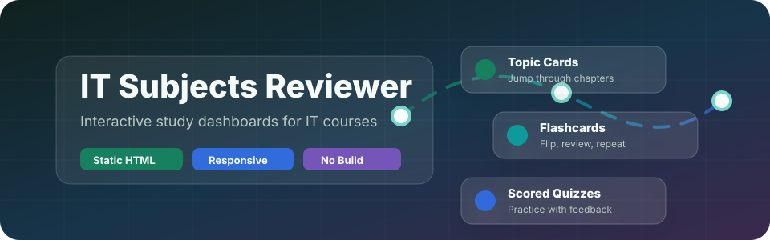

<h1>📚 IT Subjects Reviewer</h1>

**Interactive, browser-based & component-driven study reviewers for IT subjects.**

  
  
  
  

[Explore Modules](#-available-reviewers) • [Features](#-features) • [Quick Start](#-quick-start) • [Architecture](#-architecture)

---

> **Empowering IT students with lightweight, interactive, and beautifully designed study materials.**
> Whether you prefer zero-setup offline HTML files or modular React components, this repository has you covered.

## 🎯 Overview

This repository collects interactive reviewers for IT subjects, providing dual implementations for maximum flexibility:

- 🌐 **Zero-build Vanilla Apps:** Run directly in the browser via simple HTML/CSS/JS files. Perfect for GitHub pages or local offline viewing. No installation required.
- ⚛️ **Modern React Components:** Fully-featured, Tailwind-styled \`.jsx\` components ready to be dropped into your modern web applications.

## 📖 Available Reviewers

| 📚 Subject / Module | 🎯 What It Covers | 🛠️ Formats | 🔗 Links |
| :--- | :--- | :--- | :--- |
| **Networking 2** *Interactive study dashboard* | Internet architecture, application & transport layers, routing, LANs, wireless/mobile networking, and network security. | \`<Vanilla HTML>\` \`<React JSX>\` | [📁 View Folder](Networking%202/) [🚀 Open Web App](Networking%202/index.html) |
| **Systems Integration and Architecture 1** *Module 1 interactive reviewer* | Enterprise Information Architecture, IT Governance, and Information and Data Modelling with blueprint, model-layer, and scenario activities. | \`<Vanilla HTML>\` \`<React JSX>\` | [📁 View Folder](Systems%20Integration%20and%20Architecture%201/) [🚀 Open Web App](Systems%20Integration%20and%20Architecture%201/index.html) |

 

## ✨ Features

- **🧠 Interactive Learning**  
  Engage with topic cards, visual system paths, scenario challenges, interactive flashcards, scored quizzes, and searchable glossaries.

- **⚡ Zero-Build Option**  
  The vanilla implementations require zero dependencies. Just open \`index.html\` and start studying instantly.

- **⚛️ React Ready**  
  Drop the \`.jsx\` files into any React/Tailwind project for a modern, seamless integration into your own apps.

- **🧩 DRY Architecture**  
  Data is decoupled from the UI. Add new questions or terms in one file, and both React and HTML versions update automatically.

 

## 🚀 Quick Start

### 🌐 For Offline & Browser Usage (Vanilla)
1. Clone or download this repository.
2. Open a reviewer folder, such as [\`Networking 2\`](Networking%202/) or [\`Systems Integration and Architecture 1\`](Systems%20Integration%20and%20Architecture%201/).
3. Launch that folder's \`index.html\` in your favorite browser.

### ⚛️ For React Developers
1. Copy the selected reviewer component and its adjacent \`data.js\` into your project.
2. Ensure React and Tailwind CSS are available; the Networking 2 component additionally uses \`lucide-react\`.
3. Import and render the component in your application.

 

## 🏗️ Architecture

The codebase is deeply optimized for maintainability and performance. Large datasets (topics, glossaries, practice tests) are decoupled from the UI logic into a single source of truth.

\`\`\`text
IT-Subjects-Reviewer/
├─ README.md
├─ Networking 2/
│  ├─ data.js
│  ├─ index.html
│  └─ NetworkingTwoBeginnerGuide.jsx
└─ Systems Integration and Architecture 1/
   ├─ data.js
   ├─ index.html
   └─ SystemsIntegrationArchitectureOneBeginnerGuide.jsx
\`\`\`

💡 **Pro Tip:** To add a question, term, scenario, or topic, edit that reviewer's \`data.js\`. Both its HTML and React versions consume the same content contract.

 

## 📝 Notes

- Designed specifically for quick studying and rapid exam review.
- **GitHub Pages** can host the HTML files natively without installing any Node.js dependencies.
- More subjects and modules will be continually added using this scalable, decoupled structure.
