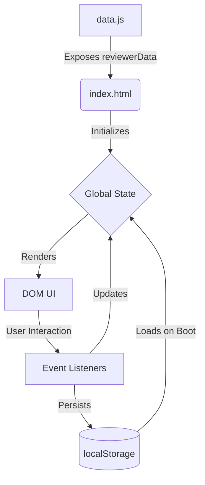

# Tech Stack Setup Guide

## Tech Stack Overview

The **IT-Subjects-Reviewer** repository is a frontend-only application using a classic web development stack with zero runtime dependencies. Tooling is provided via Node.js for static analysis and diagnostics.

*   **Language:** HTML5, CSS3, JavaScript (ES6+ Vanilla)
*   **Framework / Library:** None (Pure Vanilla JS architecture)
*   **Runtime (App):** Any modern web browser
*   **Runtime (Tooling):** Node.js (v18+ recommended)
*   **Package Manager:** `npm`
*   **Key Libraries:** `jsdom` (v29.1.1+) - Used exclusively for the `html-diagnostics.js` test script.
*   **Version Constraints:** No strict browser requirements other than ES6 support; Node environment should support ES Modules (or require).

---

## Beginner-Friendly Setup Instructions

### macOS / Linux

1.  **Install Node.js (if not already installed):**
    We recommend using `nvm` (Node Version Manager).
    ```bash
    curl -o- https://raw.githubusercontent.com/nvm-sh/nvm/v0.39.7/install.sh | bash
    nvm install 20
    nvm use 20
    ```
2.  **Clone the Repository:**
    ```bash
    git clone https://github.com/SecretlySpy/IT-Subjects-Reviewer.git
    cd IT-Subjects-Reviewer
    ```
3.  **Install Tooling Dependencies:**
    ```bash
    npm install
    ```
4.  **Run the App locally:**
    Simply open the file in your browser. You do not need a dev server!
    ```bash
    open "Networking 2/index.html"
    ```
5.  **Run Diagnostics (Optional):**
    ```bash
    node html-diagnostics.js
    ```

### Windows

1.  **Install Node.js (if not already installed):**
    Download the official installer from [nodejs.org](https://nodejs.org/) (LTS recommended). Follow the setup wizard.
2.  **Clone the Repository:**
    Open PowerShell or Git Bash and run:
    ```powershell
    git clone https://github.com/SecretlySpy/IT-Subjects-Reviewer.git
    cd IT-Subjects-Reviewer
    ```
3.  **Install Tooling Dependencies:**
    ```powershell
    npm install
    ```
4.  **Run the App locally:**
    Simply open the file in your browser by double-clicking it in File Explorer, or run:
    ```powershell
    Start-Process "Networking 2\index.html"
    ```
5.  **Run Diagnostics (Optional):**
    ```powershell
    node html-diagnostics.js
    ```

---

## Architecture Visualizations

### Component Data Flow



### Setup Process Summary

| Step | Action | Description | Required? |
| :--- | :--- | :--- | :---: |
| **1** | Download / Clone | Fetch the source code to your machine | ✅ Yes |
| **2** | Open in Browser | Open `Networking 2/index.html` to view the app | ✅ Yes |
| **3** | Install Node.js | Required only if running QA scripts | ❌ No |
| **4** | `npm install` | Installs `jsdom` for the QA script | ❌ No |
| **5** | `node html-diagnostics.js` | Runs sanity checks against the HTML/CSS | ❌ No |

---

## Common Troubleshooting Tips

*   **Issue:** The app shows blank content or broken layout on load.
    *   **Fix:** Ensure you are opening `Networking 2/index.html`, and that `Networking 2/data.js` has not been moved. The HTML relies on a relative path to `<script src="data.js">`.
*   **Issue:** `npm install` fails.
    *   **Fix:** Ensure Node.js and npm are correctly installed and added to your system `PATH`. Try running `node -v` and `npm -v` to verify.
*   **Issue:** `node html-diagnostics.js` throws an error about `jsdom`.
    *   **Fix:** You skipped `npm install`. Run `npm install` first so `jsdom` is downloaded to `node_modules/`.
*   **Issue:** Progress is not being saved across sessions.
    *   **Fix:** Ensure you are not running the browser in "Incognito" or "Private" mode, which clears `localStorage` upon exit. You also must access the file from the same origin (e.g. `file://` or `localhost`).
