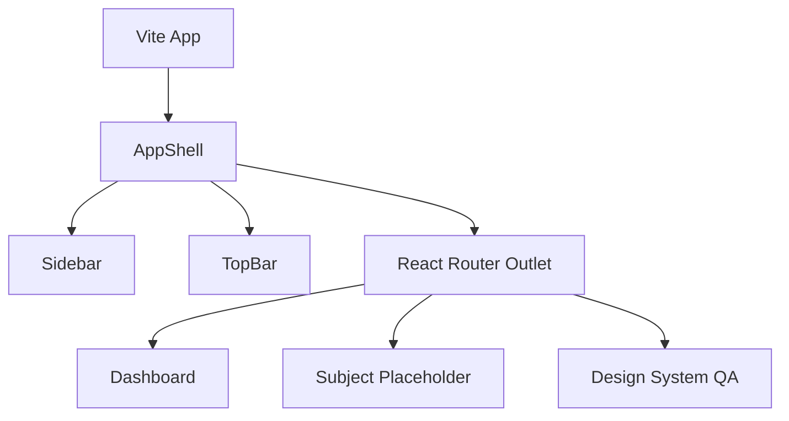

# Tech Stack Setup Guide

## Tech Stack
- **Language**: TypeScript (ES2020)
- **Framework**: React 19 (via Vite)
- **Styling**: Tailwind CSS 3 (configured via PostCSS and tailwind.config.ts)
- **Icons**: Lucide React
- **Routing**: React Router DOM (v7)
- **Package Manager**: npm
- **Build Tool**: Vite

## Setup Instructions

### macOS
1. Install [Node.js](https://nodejs.org/) (v20+ recommended).
2. Clone the repository and navigate to the root directory.
3. Run `npm install` to install dependencies.
4. Run `npm run dev` to start the local development server.

### Windows
1. Install [Node.js](https://nodejs.org/) (v20+ recommended).
2. Clone the repository and navigate to the root directory.
3. Run `npm install` to install dependencies.
4. Run `npm run dev` to start the local development server.

### Linux
1. Install Node.js via your distribution's package manager or nvm.
2. Clone the repository and navigate to the root directory.
3. Run `npm install` to install dependencies.
4. Run `npm run dev` to start the local development server.

## Visualizations

### Architecture

## Common Troubleshooting Tips

- **Vite Build Error (PostCSS / Tailwind)**: If you see an error about `tailwindcss` directly as a PostCSS plugin during build, ensure that `tailwindcss` is v3.4+ and not v4.0+, because v4 has a different PostCSS setup structure. Run `npm install -D tailwindcss@^3.4.1` to downgrade if needed.
- **Missing Module / CSS**: Ensure that `src/index.css` is imported in `src/main.tsx` and that `tailwind.config.ts` includes `content: ["./index.html", "./src/**/*.{js,ts,jsx,tsx}"]`.
- **Keyboard Shortcut Issues**: The `Cmd/Ctrl + B` sidebar toggle requires focus on the document. Ensure no input element is blocking it natively.
