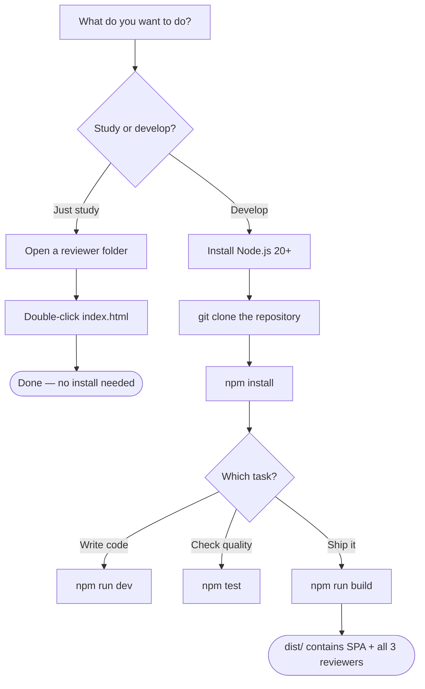
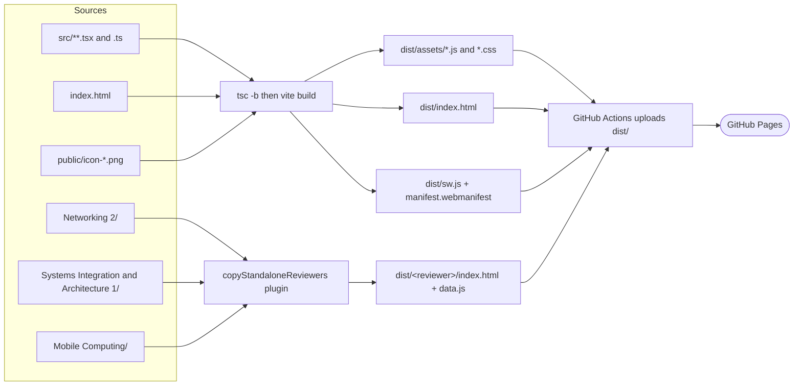

# Tech Stack Setup Guide

This repository holds two things that ship together:

1. **Zero-build reviewers** — self-contained HTML/CSS/JS study apps you can open straight from disk. No Node.js, no install, no internet.
2. **A React study platform** — a Vite + TypeScript + Tailwind single-page app with spaced repetition, an adaptive quiz, and offline (PWA) support.

If you only want to *study*, you need nothing but a browser. If you want to *develop*, you need Node.js.

---

## 1. Tech Stack

| Layer | Technology | Version constraint | Why it is here |
| :--- | :--- | :--- | :--- |
| Language | TypeScript | `^7.0.2` | Types for the React platform (`src/`) |
| Language | JavaScript (ES2023, classic scripts) | — | The zero-build reviewers (`*/data.js`, `*/index.html`) |
| UI framework | React | `^19.2.8` | Component model for the study platform |
| Routing | react-router-dom | `^7.18.1` | Hash routing so GitHub Pages needs no server rewrites |
| State | zustand + `persist` | `^5.0.14` | Progress store (mastery, streak, card scheduling) |
| Storage | idb-keyval | `^6.3.0` | IndexedDB with an automatic `localStorage` fallback |
| Styling | Tailwind CSS | `^3.4.19` | Utility styling; **must stay on v3, not v4** |
| CSS pipeline | PostCSS + autoprefixer | `^8.5.22` / `^10.5.4` | Tailwind's build step |
| Icons | lucide-react | `^1.26.0` | Icon set for the platform |
| Accessibility | react-focus-lock | `^2.13.7` | Traps focus in the mobile sidebar drawer |
| Build tool | Vite | `^8.1.5` | Dev server and production bundler |
| PWA | vite-plugin-pwa (Workbox) | `^1.3.0` | Service worker, manifest, offline precache |
| Test runtime | jsdom | `^29.1.1` | Browser-like DOM for all four test suites |
| Runtime | Node.js | **20 or newer** (24 recommended) | Required only for development; CI uses 20 |
| Package manager | npm | Ships with Node.js | `package-lock.json` is committed |

> **Module system:** `package.json` sets `"type": "module"`. Every `.js` file at the repository root is an ES module and must use `import`, not `require`. The reviewer `data.js` files are the exception — they are classic browser scripts loaded by `<script src>`, never by Node's module loader.

---

## 2. Setup Instructions

### 2.1 The fastest path (no install at all)

Works on macOS, Windows, and Linux.

1. Download or clone this repository.
2. Open any reviewer folder — for example `Systems Integration and Architecture 1/`.
3. Double-click `index.html`.

That's it. The reviewer runs entirely in the browser and saves your progress in `localStorage`.

### 2.2 Developer setup — macOS

```bash
# 1. Install Node.js 20+ (Homebrew shown; nodejs.org installer works too)
brew install node

# 2. Confirm the version
node --version        # expect v20.x or newer

# 3. Clone and enter the repository
git clone https://github.com/<your-account>/IT-Subjects-Reviewer.git
cd IT-Subjects-Reviewer

# 4. Install dependencies
npm install

# 5. Start the dev server
npm run dev           # opens on http://localhost:5173
```

### 2.3 Developer setup — Windows

Use **PowerShell** or **Git Bash**. PowerShell 5.1 does not support `&&`, so run the commands one per line.

```powershell
# 1. Install Node.js 20+ (winget shown; the .msi from nodejs.org also works)
winget install OpenJS.NodeJS.LTS

# 2. Close and reopen the terminal, then confirm the version
node --version        # expect v20.x or newer

# 3. Clone and enter the repository
git clone https://github.com/<your-account>/IT-Subjects-Reviewer.git
cd IT-Subjects-Reviewer

# 4. Install dependencies
npm install

# 5. Start the dev server
npm run dev
```

> **Folder names contain spaces** (`Systems Integration and Architecture 1`). Always quote paths: `cd "Systems Integration and Architecture 1"`.

### 2.4 Developer setup — Linux

```bash
# 1. Install Node.js 20+ via nvm (recommended over distro packages, which lag)
curl -o- https://raw.githubusercontent.com/nvm-sh/nvm/v0.40.1/install.sh | bash
source ~/.bashrc
nvm install 20
nvm use 20

# 2. Confirm the version
node --version

# 3. Clone and enter the repository
git clone https://github.com/<your-account>/IT-Subjects-Reviewer.git
cd IT-Subjects-Reviewer

# 4. Install dependencies
npm install

# 5. Start the dev server
npm run dev
```

### 2.5 Commands you will actually use

| Command | What it does | When to run it |
| :--- | :--- | :--- |
| `npm run dev` | Vite dev server with hot reload | While developing |
| `npm run build` | Type-checks, bundles, and copies the standalone reviewers into `dist/` | Before deploying |
| `npm run preview` | Serves the built `dist/` locally | To sanity-check a production build |
| `npm test` | Runs all four QA suites in sequence | Before every commit |
| `npx tsc -b --force` | Full type-check with no incremental cache | When types look stale |

---

## 3. Visualizations

### 3.1 Setup decision path



### 3.2 What the build produces



### 3.3 Where each piece of content lives

| You want to change… | Edit this file | Who consumes it |
| :--- | :--- | :--- |
| A SIA 1 term, topic, scenario, or test question | `Systems Integration and Architecture 1/data.js` | Both `index.html` and the `.jsx` component |
| A SIA 1 lesson in the React platform | `src/subjects/sia1/data.ts` | The React SPA only |
| Networking 2 or Mobile Computing content | That folder's `data.js`, or `src/subjects/<id>/data.ts` | Same split as above |
| Colours, spacing, typography | `src/design-system/tokens.ts` | The React SPA |
| Expected content totals in the tests | `html-diagnostics.js` (`expectedCounts`) | `npm test` |

### 3.4 Node.js version support

```text
Node 18  ──✗── unsupported (CI targets 20; some APIs used here landed later)
Node 20  ──✓── minimum; this is what GitHub Actions runs
Node 22  ──✓── fine
Node 24  ──✓── recommended for local development
```

---

## 4. Common Troubleshooting

| Symptom | Cause | Fix |
| :--- | :--- | :--- |
| `ReferenceError: require is not defined in ES module scope` | A root-level `.js` file used CommonJS while `package.json` declares `"type": "module"` | Convert it to `import` syntax, and derive `__dirname` from `path.dirname(fileURLToPath(import.meta.url))` |
| `tailwindcss` rejected as a direct PostCSS plugin | Tailwind v4 was installed; v4 changed its PostCSS setup | `npm install -D tailwindcss@^3.4.19` |
| Styles are missing entirely | `src/index.css` not imported, or `tailwind.config.ts` `content` globs are wrong | Confirm `import './index.css'` in `src/main.tsx` and `content: ["./index.html", "./src/**/*.{js,ts,jsx,tsx}"]` |
| `Referenced project ... may not disable emit` | `tsconfig.node.json` is a referenced composite project, which must emit | Keep `outDir` pointed at `./node_modules/.tmp/tsconfig.node` instead of setting `noEmit` |
| `vite.config.js` / `*.tsbuildinfo` keep reappearing in the repo root | `tsc -b` was emitting into the root | Already fixed via `outDir` and `tsBuildInfoFile`; the files are also in `.gitignore` |
| GitHub Pages serves the SPA but 404s on a reviewer folder | Only `dist/` is deployed | The `copyStandaloneReviewers` Vite plugin copies them; re-run `npm run build` |
| A reviewer folder loads the SPA shell instead of the reviewer | The service worker's navigation fallback caught the request | `navigateFallbackDenylist` in `vite.config.ts` excludes reviewer paths; clear the old service worker in DevTools → Application → Service Workers |
| Stale content after deploying | An old service worker is still cached | Hard-reload, or unregister the service worker in DevTools |
| `IndexedDB failed, falling back to localStorage` in test output | Expected — JSDOM has no IndexedDB | Not an error; this exercises the store's fallback path |
| `npm test` hangs or is slow on first run | The React suites bundle the app with Vite before asserting | Normal; subsequent runs reuse the npm/Vite caches |
| Paths with spaces fail in a shell | Folder names contain spaces | Quote them: `cd "Mobile Computing"` |
