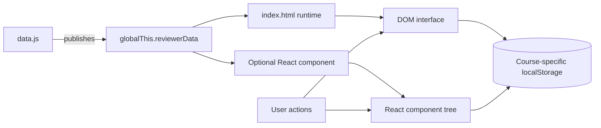

# Tech Stack Setup Guide

## 1. What This Repository Contains

**IT Subjects Reviewer** is a frontend-only collection of interactive course reviewers. Each subject ships with:

- A directly runnable `index.html` application.
- A shared `data.js` learning-content source.
- An optional React/JSX reference component for integration into another project.

Available reviewers:

| Reviewer | Offline entry point | React reference |
|---|---|---|
| Networking 2 | `Networking 2/index.html` | `Networking 2/NetworkingTwoBeginnerGuide.jsx` |
| Systems Integration and Architecture 1 | `Systems Integration and Architecture 1/index.html` | `Systems Integration and Architecture 1/SystemsIntegrationArchitectureOneBeginnerGuide.jsx` |

No server, database, account, API key, or production build is required for the offline applications.

## 2. Complete Tech Stack

| Layer | Technology | Version / constraint | Purpose |
|---|---|---|---|
| Markup | HTML5 | Modern browser | Semantic structure, dialogs, forms, navigation, and accessibility attributes |
| Styling | CSS3 | Modern browser with Grid, Flexbox, custom properties, and media-query support | Responsive layouts, themes, animation, and reduced-motion handling |
| Runtime language | JavaScript | ES2021+ recommended | Data contracts, state, rendering, search, tests, storage, and interactions |
| Offline runtime | Web browser | Current Edge, Chrome, Firefox, or Safari | Runs each `index.html` directly |
| Browser storage | `localStorage` | Built into the browser | Course-isolated theme and learning progress |
| Optional UI library | React | Supplied by the host application | Runs the optional JSX reference components |
| Optional styling | Tailwind CSS | Supplied by the host application | Styles both JSX reference components |
| Optional icon library | `lucide-react` | Supplied by the host application | Required only by the Networking 2 JSX component |
| QA runtime | Node.js | `^20.19.0`, `^22.13.0`, or `>=24.0.0` | Runs diagnostics and browser-like tests |
| Package manager | npm | Bundled with a compatible Node.js release | Installs QA dependencies and runs `npm test` |
| QA library | `jsdom` | `^29.1.1` | Executes the SIA offline app in a browser-like test document |
| Source control | Git | Any maintained release | Clones and tracks the repository |

### Important Architecture Constraint

React, React DOM, Tailwind CSS, and `lucide-react` are intentionally **not** root dependencies. The JSX files are reference components for an existing React/Tailwind host. The directly runnable HTML reviewers have no runtime package dependency.

## 3. Architecture Visualizations

### Visualization A — Runtime Data Flow



### Visualization B — Setup and Verification Path

```text
Clone repository
      |
      +---- Want to study only? ----> Open a reviewer/index.html
      |                                      |
      |                                      +--> No npm install required
      |
      +---- Want to verify/develop? -> Install compatible Node.js
                                             |
                                             v
                                        npm install
                                             |
                                             v
                                         npm test
                                      /                 \
                          Repository diagnostics   JSDOM interactions
```

### Visualization C — QA Coverage Matrix

| Check | Networking 2 | SIA 1 |
|---|:---:|:---:|
| HTML/CSS contract | ✅ | ✅ |
| JavaScript syntax | ✅ | ✅ |
| Unique IDs | ✅ | ✅ |
| Exact content totals | ✅ | ✅ |
| Quiz answer indexes | ✅ | ✅ |
| Scenario answer indexes | N/A | ✅ |
| Module relationships | N/A | ✅ |
| Browser-like interaction suite | Regression contract | ✅ |

## 4. Quick Start Without Developer Tools

Choose the instructions for your operating system. Internet access is optional; without it, the applications fall back from Google Fonts to system fonts.

### Windows

1. Download or clone the repository.

   ```powershell
   git clone https://github.com/SecretlySpy/IT-Subjects-Reviewer.git
   Set-Location "IT-Subjects-Reviewer"
   ```

2. Open Systems Integration and Architecture 1:

   ```powershell
   Start-Process "Systems Integration and Architecture 1\index.html"
   ```

3. Or open Networking 2:

   ```powershell
   Start-Process "Networking 2\index.html"
   ```

### macOS

1. Download or clone the repository.

   ```bash
   git clone https://github.com/SecretlySpy/IT-Subjects-Reviewer.git
   cd IT-Subjects-Reviewer
   ```

2. Open Systems Integration and Architecture 1:

   ```bash
   open "Systems Integration and Architecture 1/index.html"
   ```

3. Or open Networking 2:

   ```bash
   open "Networking 2/index.html"
   ```

### Linux

1. Download or clone the repository.

   ```bash
   git clone https://github.com/SecretlySpy/IT-Subjects-Reviewer.git
   cd IT-Subjects-Reviewer
   ```

2. Open Systems Integration and Architecture 1:

   ```bash
   xdg-open "Systems Integration and Architecture 1/index.html"
   ```

3. Or open Networking 2:

   ```bash
   xdg-open "Networking 2/index.html"
   ```

## 5. Developer and QA Setup

### Windows

1. Install a compatible Node.js release from the official Node.js installer. Node.js 24 or Node.js 22.13+ is recommended.
2. Confirm the installation:

   ```powershell
   node --version
   npm --version
   ```

3. Enter the repository and install the locked dependency tree:

   ```powershell
   Set-Location "IT-Subjects-Reviewer"
   npm install
   ```

4. Run the full QA suite:

   ```powershell
   npm test
   ```

### macOS

1. Install a compatible Node.js release with `nvm`:

   ```bash
   curl -o- https://raw.githubusercontent.com/nvm-sh/nvm/v0.40.3/install.sh | bash
   nvm install 24
   nvm use 24
   ```

2. Install dependencies and run QA:

   ```bash
   cd IT-Subjects-Reviewer
   npm install
   npm test
   ```

### Linux

1. Install a compatible Node.js release with `nvm`:

   ```bash
   curl -o- https://raw.githubusercontent.com/nvm-sh/nvm/v0.40.3/install.sh | bash
   nvm install 24
   nvm use 24
   ```

2. Install dependencies and run QA:

   ```bash
   cd IT-Subjects-Reviewer
   npm install
   npm test
   ```

### What `npm test` Runs

```text
node html-diagnostics.js
  -> validates both reviewer structures
  -> parses JavaScript
  -> evaluates data contracts in isolation
  -> checks IDs, counts, shapes, relationships, and answer indexes

node reviewer-interaction-tests.js
  -> boots the SIA reviewer in JSDOM
  -> tests filters, topic dialog, progress storage, and key isolation
  -> tests scenarios, flashcards, module tests, glossary, theme, and global search
```

Any failed assertion produces a nonzero exit code, which is suitable for local checks or CI.

## 6. Optional Local Web Server

Opening `index.html` directly is supported. A local server can provide more consistent browser storage and developer-tool behavior.

If Python is already installed:

### Windows

```powershell
python -m http.server 8000
Start-Process "http://localhost:8000/Systems%20Integration%20and%20Architecture%201/"
```

### macOS

```bash
python3 -m http.server 8000
open "http://localhost:8000/Systems%20Integration%20and%20Architecture%201/"
```

### Linux

```bash
python3 -m http.server 8000
xdg-open "http://localhost:8000/Systems%20Integration%20and%20Architecture%201/"
```

Stop the server with `Ctrl+C`.

## 7. Optional React Integration

The JSX files cannot be opened directly in a browser. Copy the selected component and its adjacent `data.js` into an existing React/Tailwind project.

For Systems Integration and Architecture 1:

```jsx
import SystemsIntegrationArchitectureOneBeginnerGuide from "./SystemsIntegrationArchitectureOneBeginnerGuide.jsx";

export default function App() {
  return <SystemsIntegrationArchitectureOneBeginnerGuide />;
}
```

For Networking 2, install and configure `lucide-react` in the host project in addition to React and Tailwind CSS.

The host bundler must allow the side-effect import of `./data.js`, which assigns `globalThis.reviewerData` before the component reads it.

## 8. Common Troubleshooting

### The page opens but appears blank

- Confirm that `index.html` and `data.js` remain in the same reviewer folder.
- Open browser developer tools and check the Console for the first error.
- Do not rename `data.js` unless the `<script src="data.js">` reference is also updated.
- If using a downloaded archive, fully extract it before opening the HTML file.

### Styling appears incomplete

- Ensure the entire HTML file was downloaded rather than copied from a preview page.
- Internet loss only affects Google Fonts; the layout should still work with system fonts.
- Hard-refresh the page after pulling updates:
  - Windows/Linux: `Ctrl+F5`
  - macOS: `Command+Shift+R`

### Progress does not persist

- Private/incognito sessions may clear or block `localStorage`.
- Some browsers isolate storage for `file://` pages. Use the optional local server.
- Keep using the same URL and browser profile.
- Networking and SIA progress are intentionally isolated under different key prefixes.

### The mobile page looks wider than the screen

- Pull the latest responsive SIA `index.html`.
- Hard-refresh so stale CSS is removed.
- Ensure browser zoom is set to 100%.
- The current layout constrains horizontal overflow and adds refinements at 700 and 440 pixels.

### `npm install` reports an unsupported Node engine

`jsdom` 29.1.1 requires one of:

- Node.js `20.19.0` or newer within version 20.
- Node.js `22.13.0` or newer within version 22.
- Node.js `24.0.0` or newer.

Switch to Node.js 24 or a compatible release, then run:

```bash
npm install
```

### `npm test` fails on content counts

- Do not change one generated collection without updating its source.
- The SIA contract requires exactly:
  - 3 modules
  - 14 topics
  - 60 glossary entries
  - 54 flashcards
  - 3 tests / 60 questions
  - 4 blueprint stages
  - 3 model layers
  - 18 scenarios
  - 4 study steps
- Update diagnostic expectations only when a deliberate product requirement changes.

### `npm test` fails on answer indexes

- Every `answer` is zero-based.
- The first option is index `0`.
- The answer must be smaller than `options.length`.
- Every question and scenario must include an explanation.

### JSX imports fail

- Confirm the JSX component and its matching `data.js` are adjacent.
- Confirm React and Tailwind CSS exist in the host project.
- Install `lucide-react` for the Networking JSX component.
- Do not treat the root repository as a configured React build; it intentionally has no bundler.

### Git reports LF/CRLF warnings on Windows

These warnings describe line-ending conversion and do not indicate broken reviewer code. Use the repository’s Git configuration and avoid manually converting unrelated files.

## 9. Verification Checklist

Before submitting changes:

1. Open both offline reviewer entry points.
2. Confirm desktop and narrow layouts do not overflow.
3. Exercise theme switching, navigation, and search.
4. For SIA, test module filtering, topic dialogs, blueprint stages, model matching, scenarios, flashcards, tests, and glossary filtering.
5. Confirm page reload restores SIA progress without changing Networking progress.
6. Run:

   ```bash
   npm test
   ```

7. Require a zero exit code and the terminal marker:

   ```text
   JSDOM_INTERACTION_SUITE_PASSED
   ```
